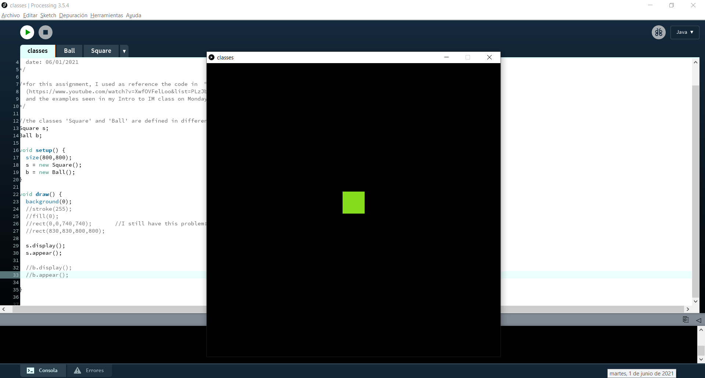
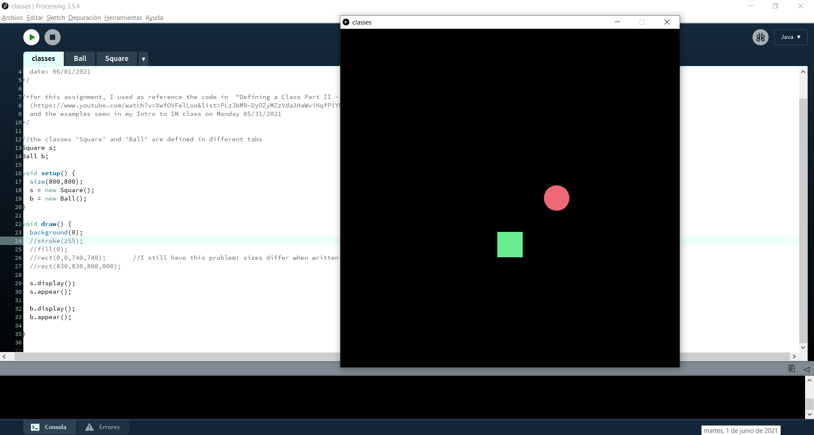
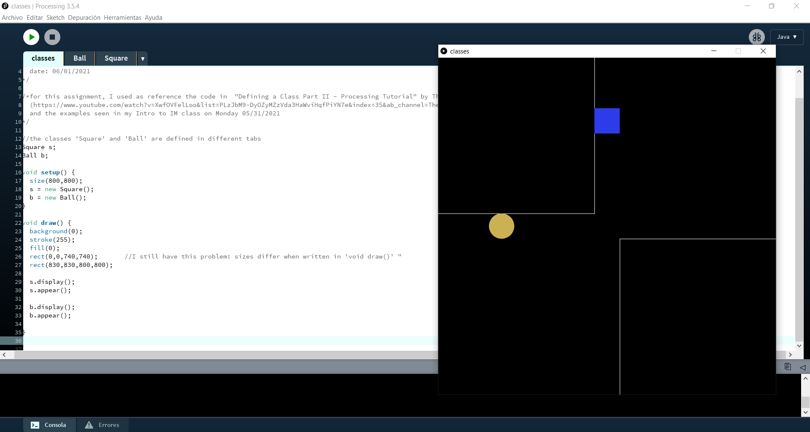
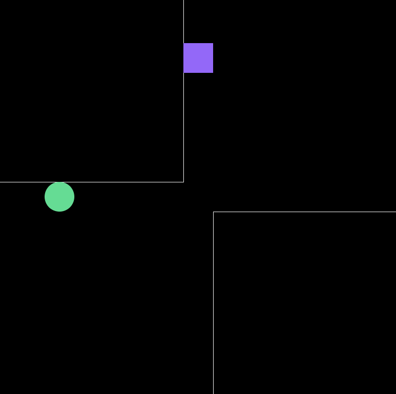
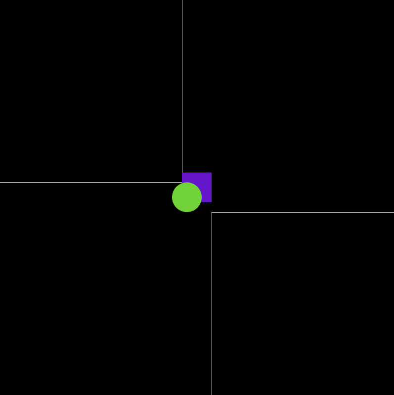
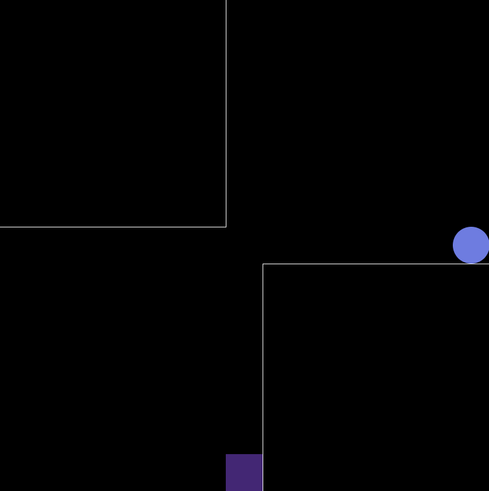

# Intro to IM | 06/01/2021 : working with "Processing"

## Create either an artwork or a game using Object Oriented Programming
For this assignment, I used as reference the code from  [*"Defining a Class Part II - Processing Tutorial"*](https://www.youtube.com/watch?v=XwfOVFelLoo&list=PLzJbM9-DyOZyMZzVda3HaWviHqfPiYN7e&index=35&ab_channel=TheCodingTrainTheCodingTrainVerified) by The Coding Train
  and the examples seen in my Intro to IM class on [Monday 05/31/2021](https://github.com/michaelshiloh/IntroductionToInteractiveMedia/blob/master/lectureNotes.md#may-31-2021)

I was struggling understanding how to 

#### Step 1:

#### Step 2:

#### Step 3:

### Final result:
  

https://youtu.be/3ExoLyjA61U

