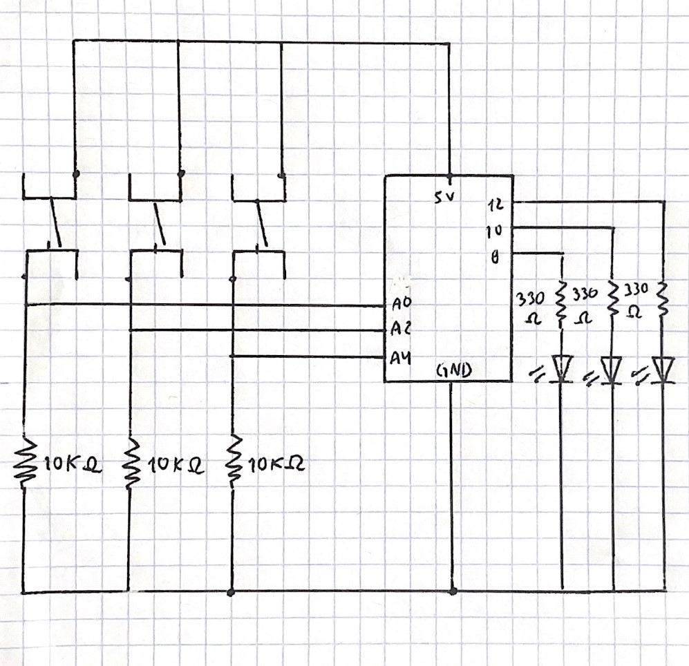

# Intro to IM | 06/14/2021 : working with "Arduino"

## Puzzle on Arduino

The instructions for this assignment were to use at least three switches and three LEDs to create a puzzle.

#### Schematic:

For the schematic, I used as reference [the one seen in class](https://github.com/michaelshiloh/IntroductionToInteractiveMedia/blob/master/media/handDrawnSchematicExample.jpg) and I added one switch.



#### Code Commented:

The user can push the switches in 9 different ways _(Y : Yellow, R : Red, G : Green)_:

YRG, RGY, GRY
YGR, RYG, **GYR** (right combination)

For each combination, I code how the lEDs would behave. Here's an example:

````
//YRG
  if ((yellowBS == HIGH) && (yellowLS == LOW && redLS == LOW && greenLS == LOW))
  {
    digitalWrite(yellowLED, HIGH);
  }
  if ((redBS == HIGH) && (yellowLS == HIGH && redLS == LOW && greenLS == LOW))
  {
    digitalWrite(greenLED, HIGH);
    digitalWrite(redLED, LOW);
    digitalWrite(yellowLED, HIGH);
  }
  if ((greenBS == HIGH) && (yellowLS == HIGH && redLS == LOW && greenLS == HIGH))
  {
    digitalWrite(greenLED, LOW);
    digitalWrite(redLED, LOW);
    digitalWrite(yellowLED, LOW);
  }
  
````

### Final result:

[Click here to see how this puzzle works.](https://youtu.be/R-zqb6z5RGg) 
