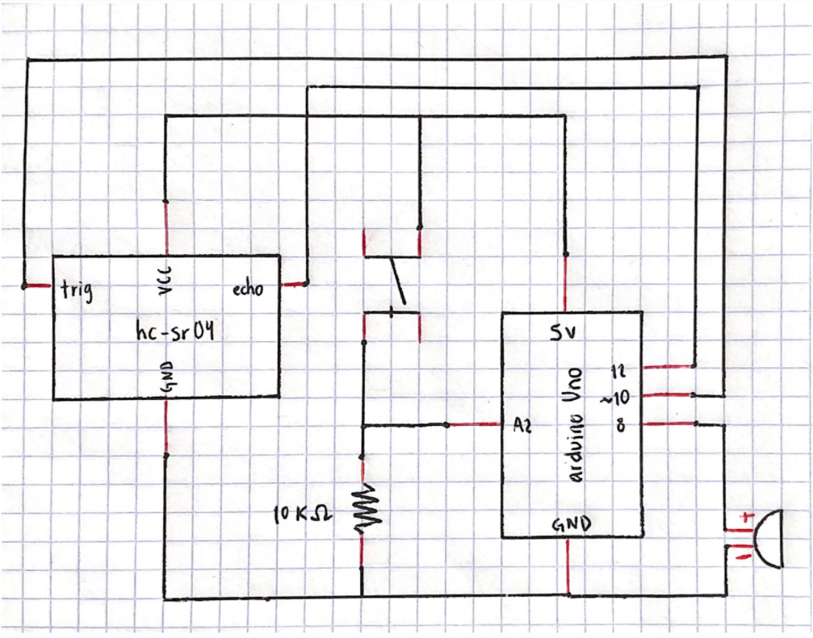

# Intro to IM | 06/21/2021 : working with "Arduino"

## Making an instrument

The instructions for this assignment were to make a musical instrument using at least one digital sensor and one analog sensor. I chose to use a switch and an ultrasonic distance sensor.

For the concept, I wanted to create an intrument that plays all the notes in the C major scale which is the most common one. The principle is to play the instrument placing a hand in front of the sensor. The note played changes according to the distance and the switch changes the notes in the scale.

For this code, I used as reference the example given by my professor in the [_SparkFun Inventor's Kit Experiment Guide_](https://learn.sparkfun.com/tutorials/sparkfun-inventors-kit-experiment-guide---v41/circuit-3b-distance-sensor). It was very useful to understand how an ultrasonic distance sensor works, especially being my first time working with one.

#### Schematic and circuit:

This is the schematic of the circuit:



This is the circuit built:


#### Problems and results:

I wanted to have the 8 notes of the C major scale in my instrument, but I didn't want the user to have trouble playing them, due that the ultrasonic distance sensor is not that precise. That's why I decided to divide the scale in two. 

If the switch is not pressed, the user can play the first 4 notes in the scale:

````
  if ((buttonState == LOW)&&(distance <= 3)) {
    tone(8, NOTE_C5);
  } else if ((buttonState == LOW)&&(3 < distance && distance < 6)) { //if the object is a medium distance
    tone(8, NOTE_D5);
  } else if ((buttonState == LOW)&&(6 < distance && distance < 9)) { //if the object is a medium distance
    tone(8, NOTE_E5);
  } else if ((buttonState == LOW)&&(9 < distance && distance < 12)) { //if the object is a medium distance
    tone(8, NOTE_F5);
  } else if ((buttonState == LOW)&&(12 <= distance)) { //if the object is a medium distance
    noTone(8);          //nothing sounds when the hand isn't placed in front of the sensor
  }
````
The next 4 notes can be played when the button is pressed:
````
  
  //BUTTON PRESSED: G, A, B, and C can  be played
  if ((buttonState == HIGH)&&(distance <= 3)) {
    tone(8, NOTE_G5);
  } else if ((buttonState == HIGH)&&(3 < distance && distance < 6)) { //if the object is a medium distance
    tone(8, NOTE_A5);
  } else if ((buttonState == HIGH)&&(6 < distance && distance < 9)) { //if the object is a medium distance
    tone(8, NOTE_B5);
  } else if ((buttonState == HIGH)&&(9 < distance && distance < 12)) { //if the object is a medium distance
    tone(8, NOTE_C6);
  }

````

### Final result:

[Click here to see how the instrument works](https://youtu.be/9-U5cu0vJUw) 
