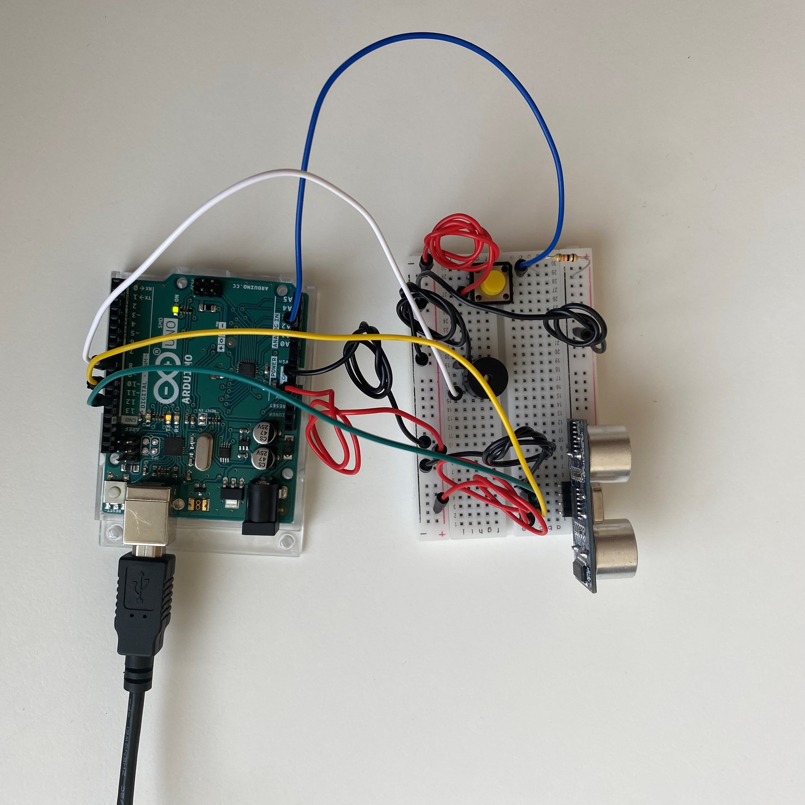

# Intro to IM | 06/21/2021 : working with "Arduino"

## Making an instrument

The instructions for this assignment were to _"get information from at least one analog sensor and at least one digital sensor (switch), and use this information to control at least two LEDs, one in a digital fashion and the other in an analog fashion, in some creative way."_

#### Schematic and circuit:

We saw in class that we could make the LEDs fade with an analog sensor (LDR), and I liked when we made them blink using a _delay()_. So for this project I wanted to mixed both examples to practice.

For the concept, I wanted the LEDs to behave in 4 different ways depending on the conditions:
- 1. With normal light, if the button is not being pressed, the LEDs are on.
- 2. With normal light, if the button is being pressed, the LEDs blink.
- 3. Without the button being pressed, with faint light, the LEDs fade slowly. (The user can place their hand above the LDR)
- 4. Without the button being pressed, with extra light, the LEDs fade fast. (The user can use a flashlight)

#### Schematic and circuit:

This is the schematic of the circuit:


This is the circuit built:



#### Problems and results:

I needed to define an interval of values for the LDR, for when the user is not manipulating none of the sensors. For this, I used the _AnalogReadSerial_ example that is on Arduino. 


After trying different lightning conditions, I chose these values and worked really well. The LDR was tested in my dorm, with the blinds opened and at 9am, so I probably would have to change these values to make it work in a different place.

````
  //1. if normal light, LEDs are on (interval set after testing AnalogReadSerial)
  if (LDRvalue >= 960 && LDRvalue <=970){
    digitalWrite(LED1, HIGH);
    digitalWrite(LED2, HIGH);
  }
````

### Final result:

[Click here to see how this program works.](https://youtu.be/BTft7RbqRRs) 
