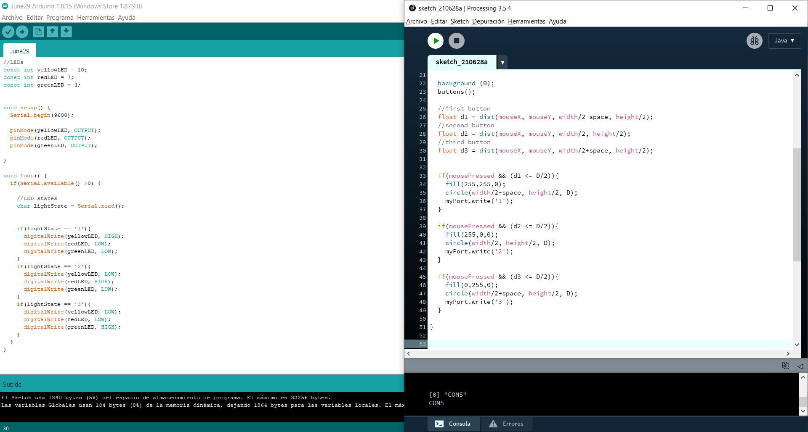

# Intro to IM | 06/28/2021 : working with "Arduino"

## Serial communication with Arduino and Processing:

For this assignment, we needed to make a simple game involving communication between Arduino and Processing. I wanted to be able to understand how this communication works, so for my concept I decided to worked upon a puzzle I had already coded on [June 14th](https://github.com/andresugartechea/introToIM/tree/main/June14) using switches. For this new version, I wanted to replace the switches for buttons on the screen, so the user could control the LEDs from Processing.

For the code, I used as reference the [_Graph_](https://www.arduino.cc/en/Tutorial/BuiltInExamples/Graph/) example from Arduino.


#### Schematic and circuit:

This is the schematic of the circuit:


This is the circuit built:


#### Problems and results:

Before starting coding the puzzle, I first wanted to make sure that I could control the LEDs from Processing. This is the code that I used at the beginning:



I had success at communicating from Processing to Arduino to turn on each one of the LEDs, making the buttons appearing on screen clickable. However, I couldn't figure out how to communicate back from Arduino to Processing. My idea was to make pop up a "End game" screen when the puzzle was resolved and for that I needed more practice with serial communication. I tried with different codes, but none of them gave results. I leave this one as example:

On Arduino:
````
    if ((yellowLS == HIGH && redLS == HIGH && greenLS == HIGH)) {                           //This part didn't work for the same reasons I explained above.
      Serial.write(win = 1);
    } else {
      Serial.write(win = 0);
    }
````
On Processing:
````
  if (win == 1) {                              //It doesn't work, but it was supposed to change the background when the player wins.
    background(255);
  }
````
I plan on learning how to create this type of communication with my final project, which requires a similar interaction.

### Final result:

[Click here to see how the program works](https://youtu.be/7uzysc93rJk) 
