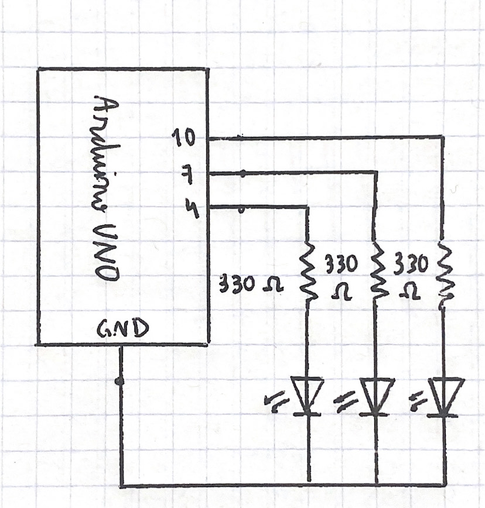
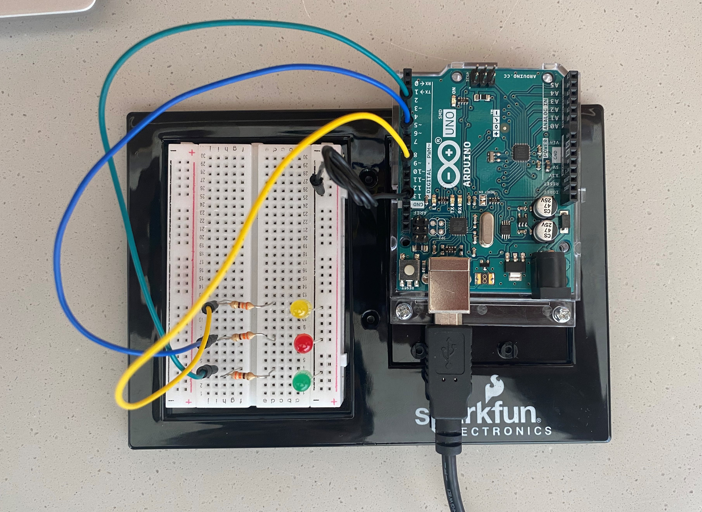

# Intro to IM | 06/28/2021 : working with "Arduino"

## Serial communication with Arduino and Processing


#### Schematic and circuit:

This is the schematic of the circuit:



This is the circuit built:



#### Problems and results:


````
nkkn
````

### Final result:

[Click here to see how the program works](https://youtu.be/HfPBJU-Ug58) 
