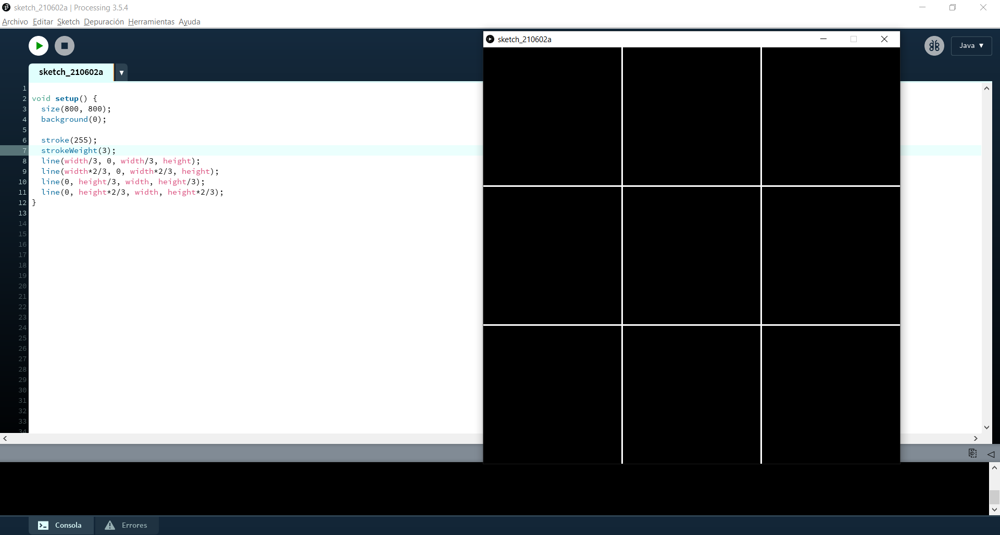
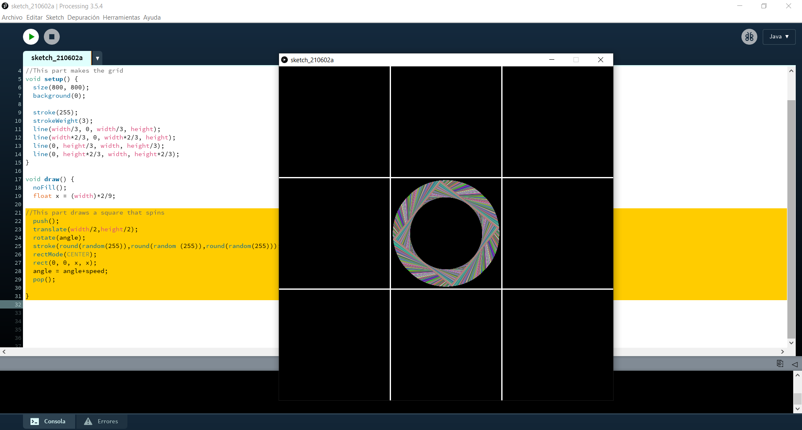
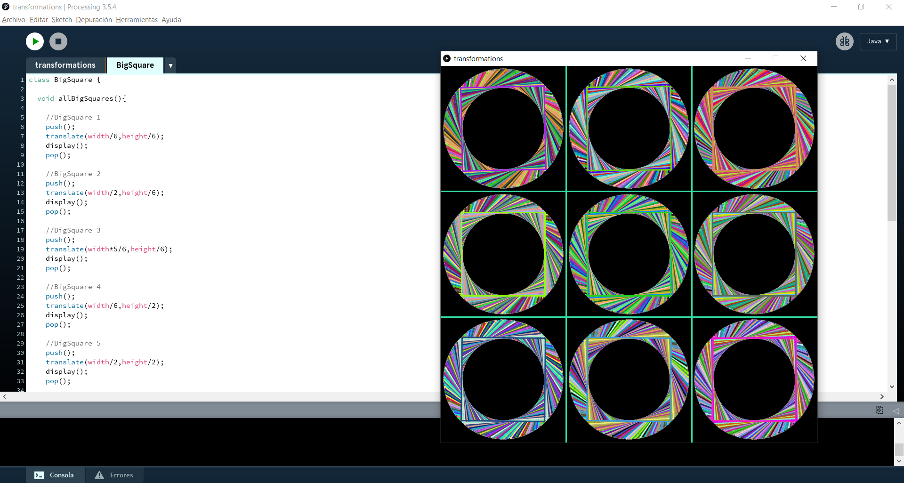
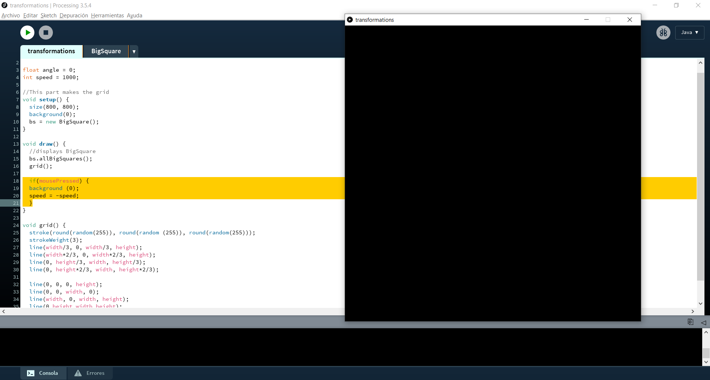
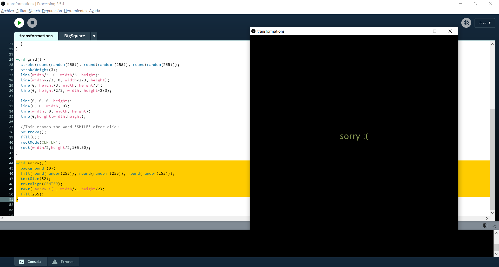
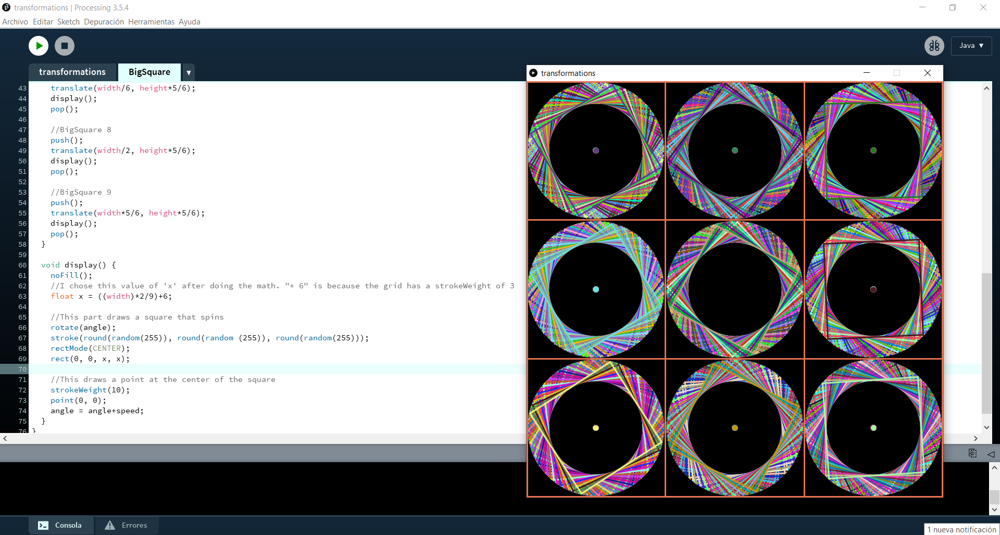

# Intro to IM | 06/03/2021 : working with "Processing"

## Simple artwork using transformations

The instructions of this assignment were to create a work of art using transformations and classes in some way. The concept of my project was inspired by psychedelic art. I wanted to create an animation that was attractive but hard to watch after a moment. 

#### Step 1:
I knew that I wanted to work with symmetry, so I started drawing a 3x3 grid on the canvas.

#### Step 2:
Then, I wanted to draw a circle that spins at the center of each part of the grid. Nonetheless, I realized that this idea was not interesting because the viewer wouldn't notice that the circle is spinning. So I changed the circle for a square and I liked the result.

#### Step 3:
I moved the previous code to a class so I could changed the translations and draw more squares spinning on the canvas.

 

#### Step 4:

Based on my experience, this program can cause nausea and headache after a long exposure. That's why I decided to add the option of stoping the visuals if you click the mouse. The message 'sorry :(' appears on screen when you stop it.

Something that I couldn't figure out is how to delete the text after the user clicks the mouse. So I had to use a black rectangle as patch.

 

 

### Final result:
Finally, I decided to put circles at the center of each square to have a better composition. This assignment helped me understand better how to uses classes and was a good introduction for working with transformations.

 

You can click on this link to see what my program looks like:
https://youtu.be/alAhpsIMT24

