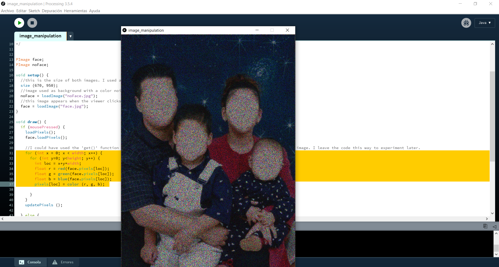
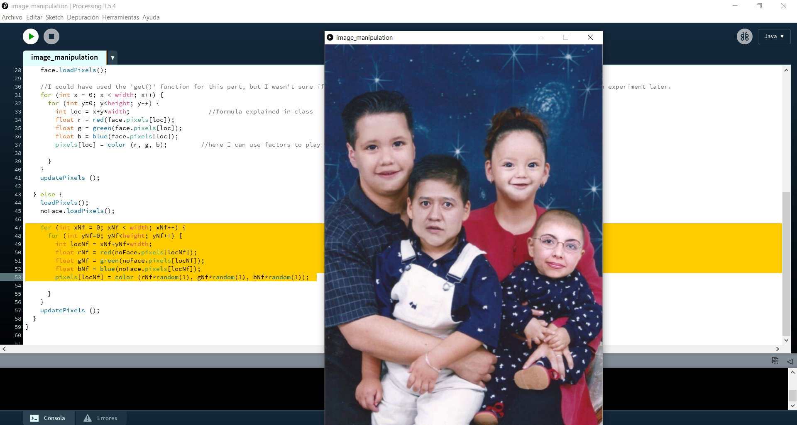
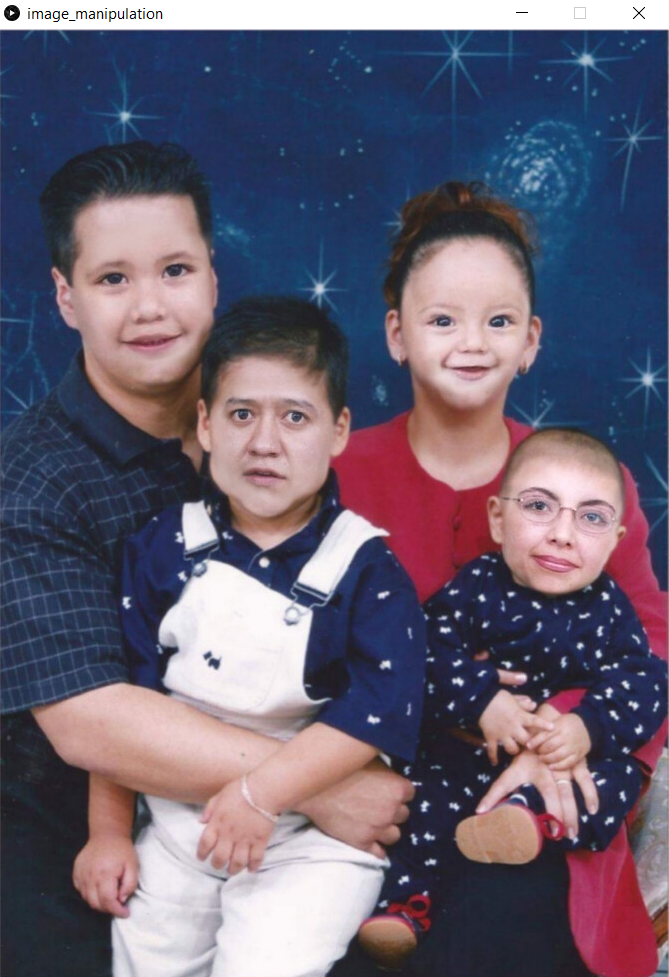
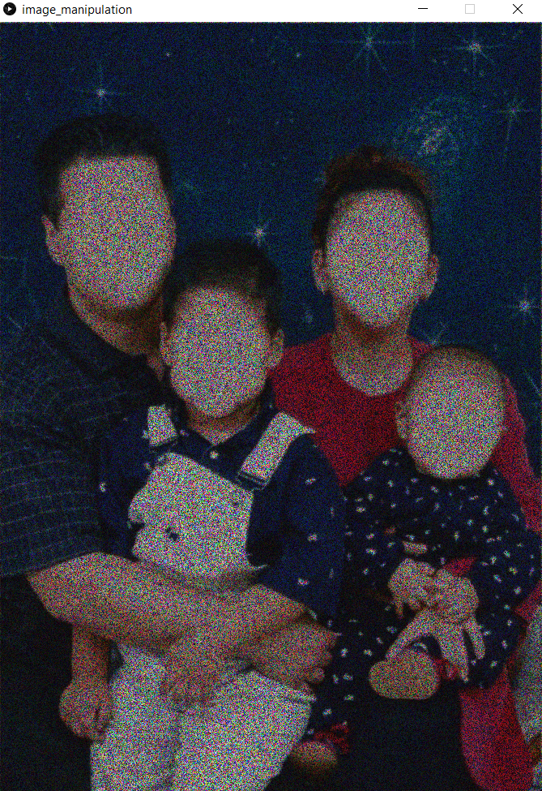

# Intro to IM | 06/07/2021 : working with "Processing"

## Image manipulation

For this project, we needed to make a simple work of art using some form of image manipulation

The concept of my project was 

#### Step 1:

#### Step 2:

### Final result:

  

You can click on this link to see what my program looks like:
https://youtu.be/alAhpsIMT24

