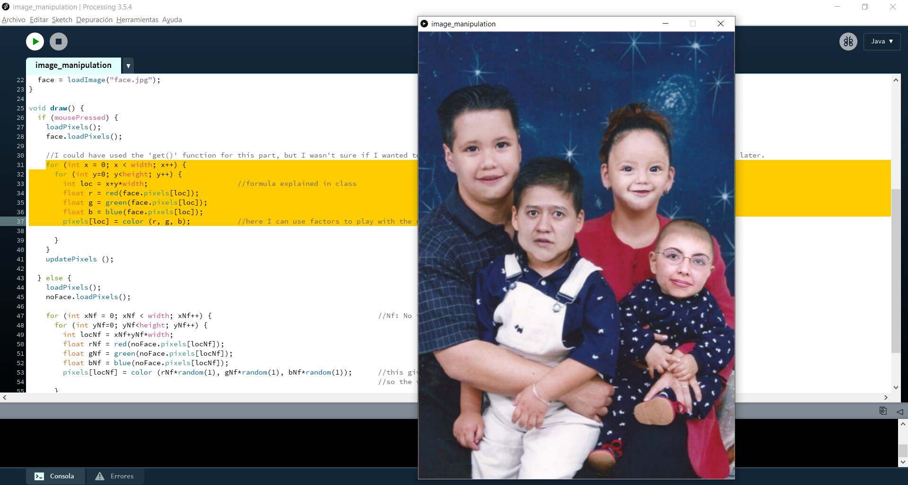

# Intro to IM | 06/07/2021 : working with "Processing"

## Image manipulation

For this assignment, we needed to make a simple work of art using some form of image manipulation. The concept of my project is something that I've been developping in previous artworks: I edit vernacular photographies to convey a message about the sense of identity. Here, the program starts with a screen showing a faceless family portrait with a color noise effect. When the viewer clicks the mouse, the noise effect disappears and they can see the photography with its original colors and with faces this time. Nonetheless, the babies have the face of their parents and vice versa. This seeks to represent the idea of heritage and family values.

#### Step 1:
I started this code by 

#### Step 2:

### Final result:

 

Click on this video to see how my program works:
https://youtu.be/lTrjkfNs5UI

