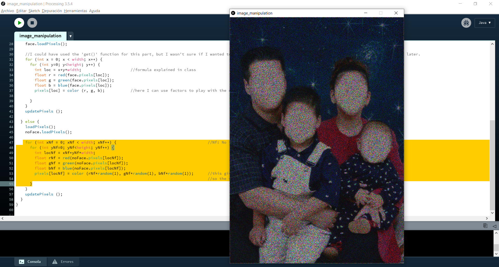

# Intro to IM | 06/07/2021 : working with "Processing"

## Image manipulation

For this assignment, we needed to make a simple work of art using some form of image manipulation. The concept of my project is something that I've been developping in previous artworks: I edit vernacular photographies to convey a message about the sense of identity. Here, the program starts with a screen showing a faceless family portrait with a color noise effect. When the viewer clicks the mouse, the noise effect disappears and they can see the photography with its original colors and with faces this time. Nonetheless, the babies have the face of their parents and vice versa. This seeks to represent the idea of heritage and family values.

#### Step 1:
Before coding, I edited the portraits with different raster graphics editors (Photoshop and PicsArt). Then, I started this code by uploading the faceless family portrait and used the _load.Pixels()_ function to use it on the canvas. I had used the _background()_ and _get()_ functions before these ones highlighted, but I was not able to make modifications to the image. So this code allowed me to display the portrait every time the user clicks the mouse.

#### Step 2:
In the second step, I completed the _if(mousePressed)_ function with and _else_, so the second image appeared when the viewer runs the program. I used basically the same code to edit the second portrait, but this time I multiplied the color r, g, b values of the image by a _random(1)_ factor. The maximum value of _random (1)_ is 1 so the values of r, g, and b can fluctuate between 0 and 255. This gives the noise color effect that I was looking for to give a creepier look to the faceless portrait.

### Final result:
Something that I liked about this project is that it allowed me to keep developing my artworks about the identity in a style that I hadn't exploited before. However, I think that I could have explored other effects, focusing more on the coding part than on the image pre-edition. I plan on continue working with images and pixels so I can start more complex and interesting projects.

 

Click on this video to see how my program works:
https://youtu.be/lTrjkfNs5UI

