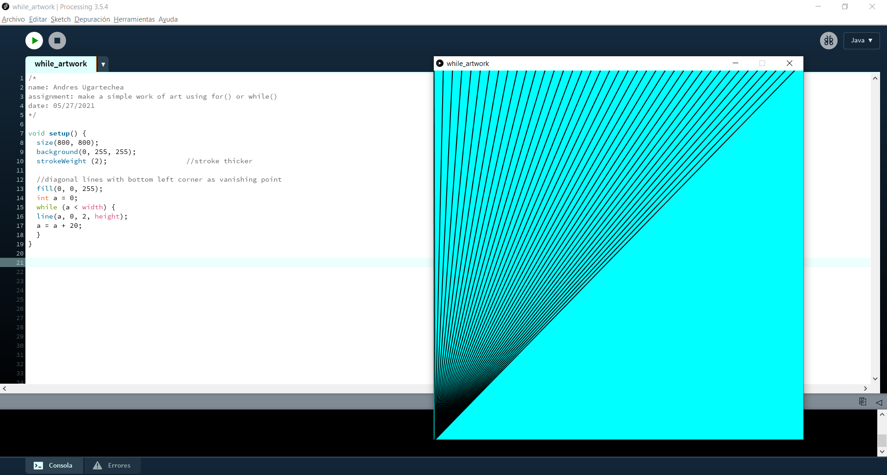
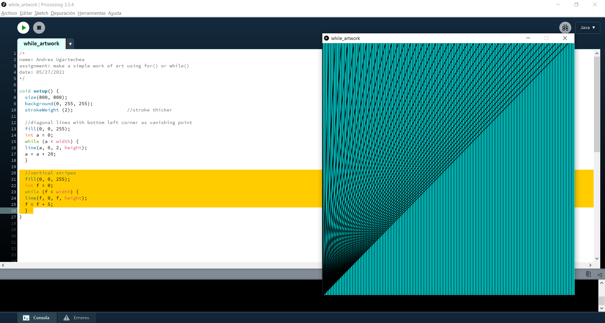
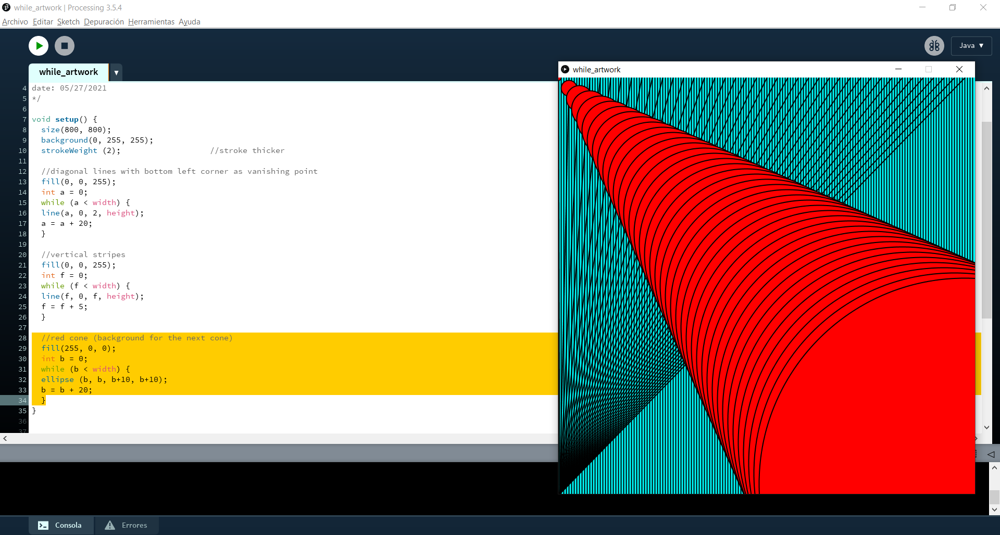
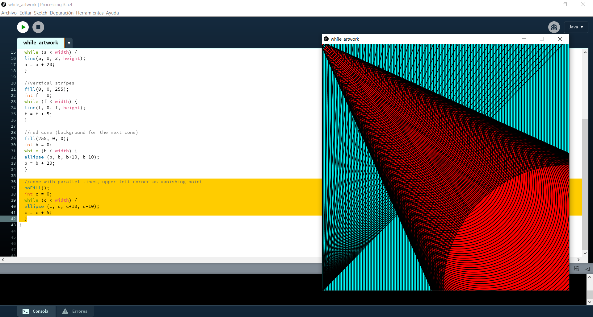
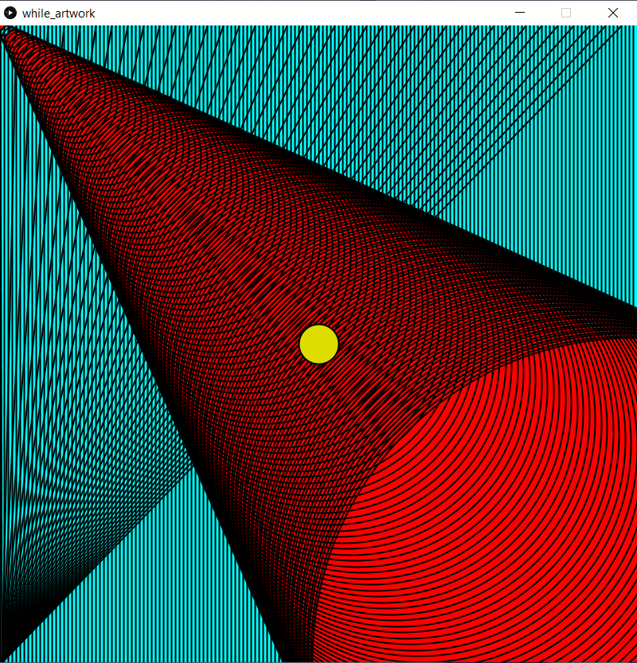

# Intro to IM | 05/27/2021 : working with "Processing"

## : Work of art using loops
For this activity, we needed to make a simple work of art using the loops *'for()'* or *'while()'* on "Processing". This was my first time working with these fonctions, so I didn't make a sketch before starting coding. At first I felt like my lack of skills wouldn't allow me to create something interesting. Nevertheless, I decided to explore, play with the loops, see how they behave, and I tried to make it look aesthetic. I'm content with the result.

#### Step 1:

#### Step 2:

#### Step 3:

#### Step 4:

#### Step 5:

### Final result:
Here is my final result:

