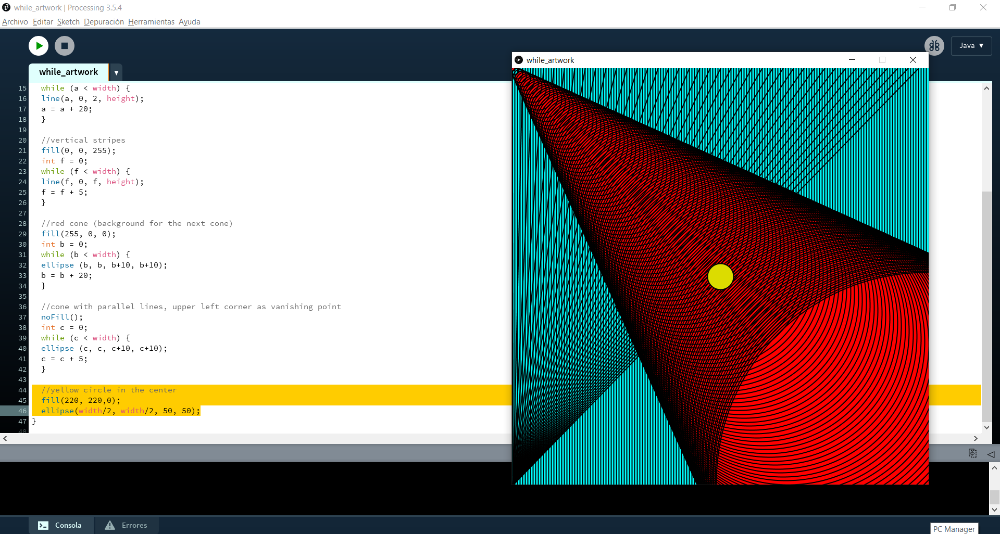

# Intro to IM | 05/27/2021 : working with "Processing"

## : Work of art using loops
For this activity, we needed to make a simple work of art using the loops 'for()' or 'while()'

#### Step 1:

#### Step 2:

#### Step 3:

#### Step 4:

#### Step 5:

### Final result:
Here is my final result:

