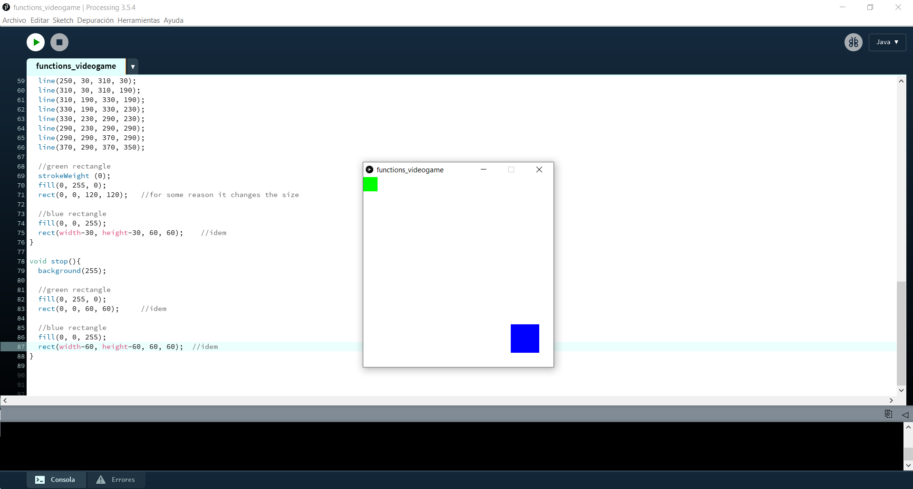

# Intro to IM | 05//231021 : working with "Processing"

## : Creating an artwork or a videogame using functions

#### Step 1:

#### Step 2:

#### Step 4:

#### Step 5:

### Final result:
These are some screenshots of the final result:

  

https://youtu.be/cjvH1t313CM

