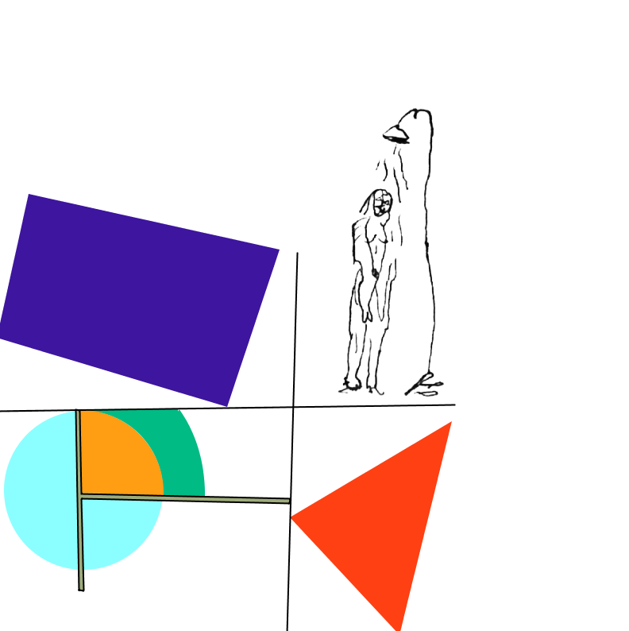
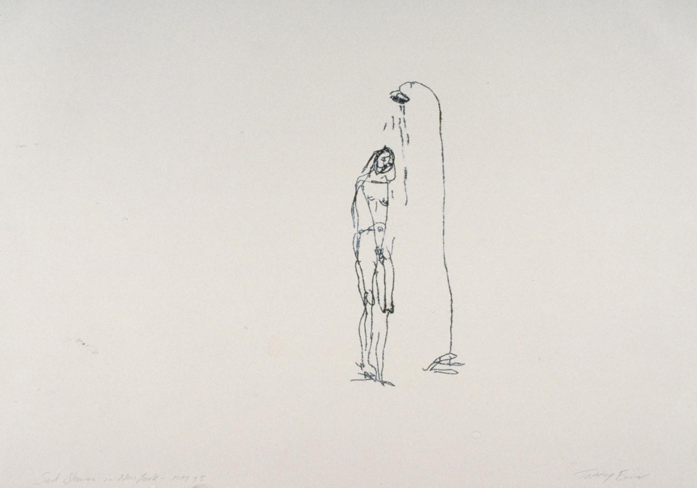

# Intro to IM | Midterm Project: "UNBREAKABLE", videogame

## Project description:

_"Sad shower in New York"_ is an artwork from my portfolio recreated on raster graphic editors and Processing to add interaction with Arduino using sensors.   

The concept was inspired by the combination of two paintings of my choice: _"Sad shower in New York"_ by Tracey Emin (left), and _"Composition"_ by Sophie Taeuber-Arp (right).

 

The purpose of this project is to reinforce the melancholic tone of the original painting through the interactivity provided by the sensors, adding primarily sound, movement, animation and playing with the color palettes. This also seeks to create a story and make the audience active participants of it.

## Process:

The process is explained in more detail in my [journal](https://github.com/andresugartechea/introToIM/blob/main/finalProject/journal.md) and on the code comments. In summary, I first chose the sensors I wanted to work with. Then I tried to link each sensor behavior, their movement, to an element from the painting. This is something that I consider clever about this project, because the interaction became meaningful and somehow intuitive:
   - the sliding of the SPDT switch tries to simulate the entrance of the woman on screen.
   - the potentiometer simulates the rotation of the water tap.
   - the button makes the woman cry when is pressed, as though she was releasing tension and letting her feelings flow.
   - the LDR displays the message _"it's okay, you're okay"_ when the user approches his hand to the sensor, as if he was trying to comfort and calm the woman.

   #### Major problems and solutions:
   
As an Arduino and Processing beginner, I struggled understanding how the serial communication between these softwares works. I learned a lot with this project and coding doesn't seem intimidating to me anymore. Some (now simple) problems that I faced were:
- building my circuit on a large breadboard from scratch (mainly because I forgot that their power rails are divided in two, unlike the small ones).
- communicating the values captured by the sensors to Processing (this was caused by a syntax error, which taught me to be more cautious with my coding).
After this, continuing with my project was easier and faster.

## Schematic and circuit:

This is the schematic of the circuit:

This is the circuit built:

## Final result: 

·Phase 1: none of the sensors are used.  
   
·Phase 2: the SPDT is switched.  
  
·Phase 3: the potentiometer is turned and we can hear the water running louder every time.  
    
·Phase 5: the button is pressed and the woman starts crying.  
·Phase 6: the LDR is covered and captures less light.  
  

[You can click see to see how my project works](https://youtu.be/N0Urd3sjneE)

