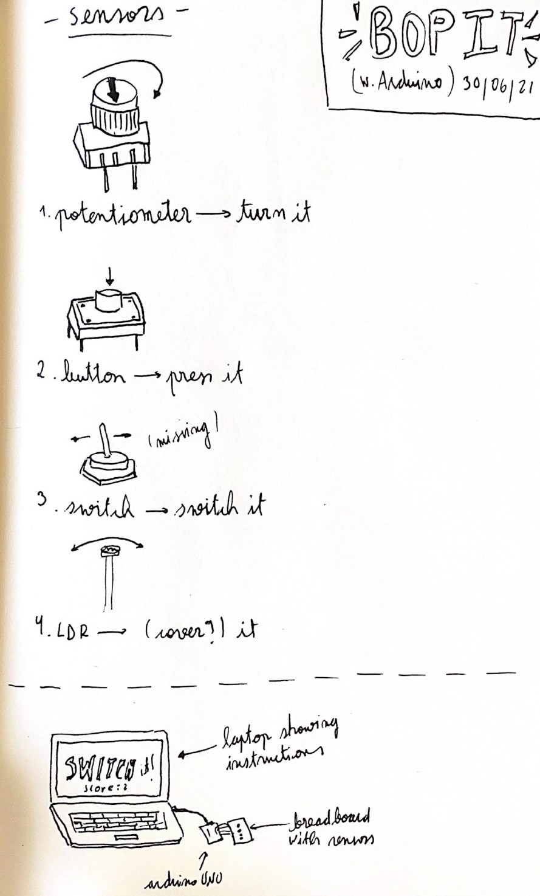

## Day 1 | Monday 06/07/2021 : midterm Project

[MAIN PAGE](https://github.com/andresugartechea/introToIM/blob/main/finalProject/journal.md)  
[next →](https://github.com/andresugartechea/introToIM/edit/main/finalProject/day2/day2.md) 

## Tasks:


## Progress:

Arduino sensor "Bob It"

For my final project I want to recreate the game _"Bob It"_ using sensors. I'll be using [Intructable Circuits' Simon says game tutorial](https://www.instructables.com/Arduino-Simple-Simon-Says-Game/) as reference, which has a similar playability.



I'm not sure if this idea is feasible, but for making the task easy I want to use these four sensors which I already know how to incorporate in circuits and coding. I plan on using Processing for the game instructions. The screen will indicate the user what to do and how to use the sensors.

## Code commented:

````

````

## Results:


## Modifications:


## Problems to solve:


[MAIN PAGE](https://github.com/andresugartechea/introToIM/blob/main/finalproject/journal.md)  
[next →](https://github.com/andresugartechea/introToIM/edit/main/finalProject/day2/day2.md) 
