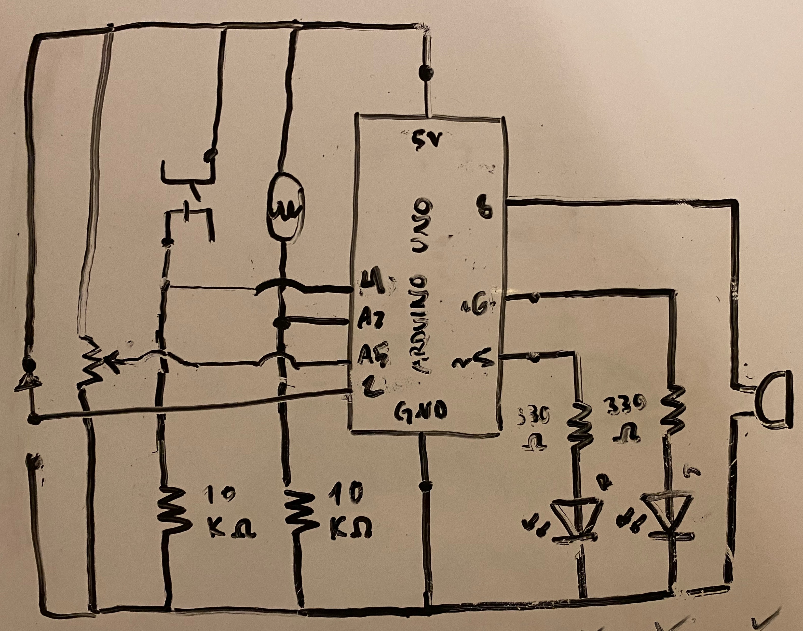
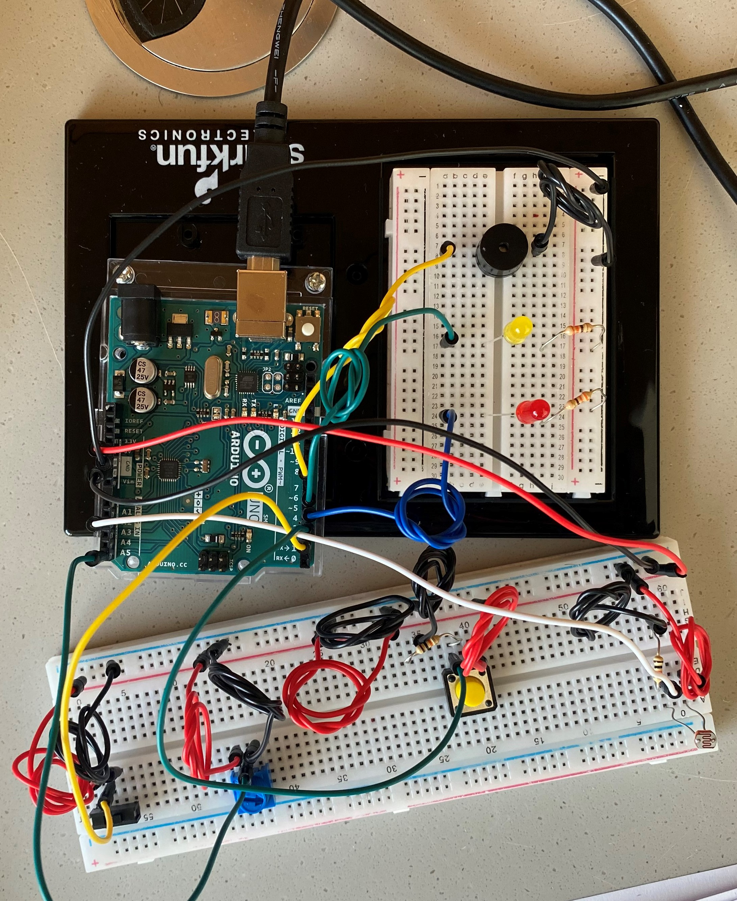
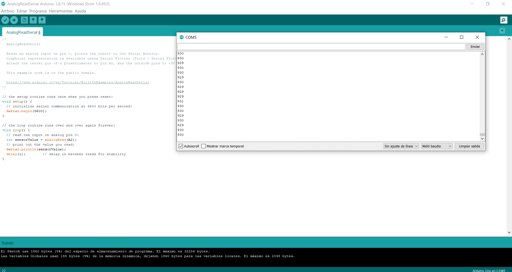

## Day 1 | Sunday 07/04/2021 : midterm Project

[MAIN PAGE](https://github.com/andresugartechea/introToIM/blob/main/finalProject/journal.md)  
[next →](https://github.com/andresugartechea/introToIM/blob/main/finalProject/day2/day2.md) 

## Tasks:

·Work on the project's concept.  
·Look for similar ideas on the internet.  
·Draw the schematic and build the circuit.

## Progress:

For my final project I want to recreate the game _"Bob It"_ using sensors. I plan on using [Intructable Circuits' Simon says game tutorial](https://www.instructables.com/Arduino-Simple-Simon-Says-Game/) as reference, which has a similar playability.

I made these drawings to start thinking about how to use at least 4 sensors as demanded. I'm not sure if this idea is feasible, but for making the task easy I want to use these four sensors which I already know how to incorporate in circuits and coding. I plan on using Processing for the game instructions. The screen will indicate the user what to do and how to use the sensors.

While drawing the schematic, I considered also incorporation two LEDs and a speaker and to figure out later how to add them to the concept.

Then, I started building the circuit. This is how it looks:

## Code commented:

I used the example code on Arduino to test each digital and analog sensor, as well as the LEDs and the speaker.

## Results:

I built the circuit successfully, so tomorrow I can start working on the serial comunication between Arduino and Processing.

## Problems to solve:

I'm not fully content with the concept because the final product doesn't seem attractive in my mind, so I might change of idea tomorrow.

[MAIN PAGE](https://github.com/andresugartechea/introToIM/blob/main/finalProject/journal.md)  
[next →](https://github.com/andresugartechea/introToIM/blob/main/finalProject/day2/day2.md)
