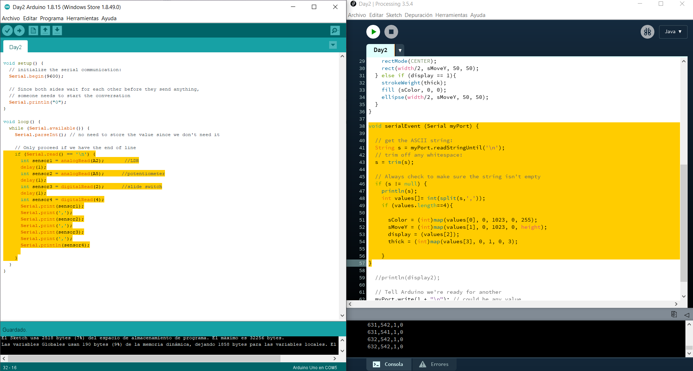
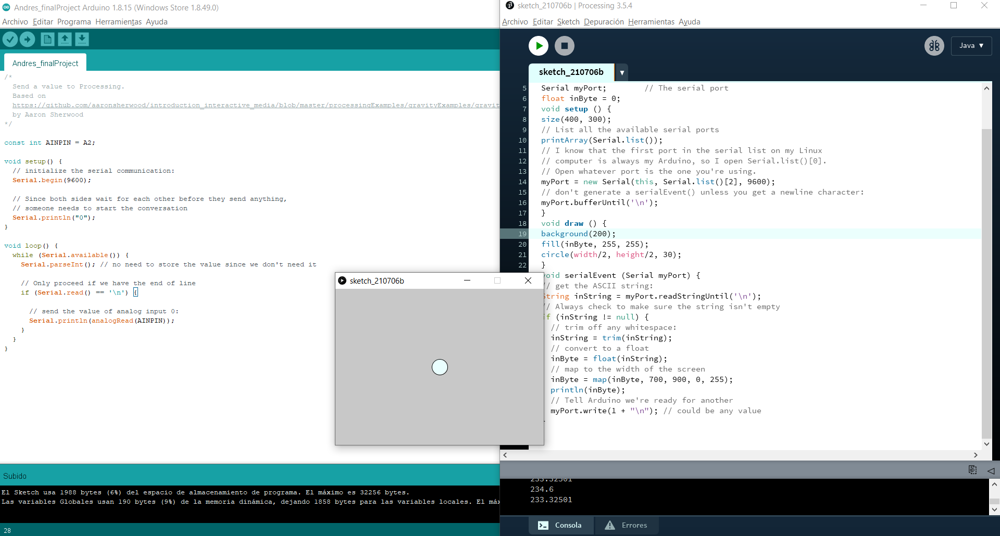

## Day 2 | Monday 07/05/2021 : final Project
  
[← return](https://github.com/andresugartechea/introToIM/blob/main/finalProject/day1/day1.md)  
[MAIN PAGE](https://github.com/andresugartechea/introToIM/blob/main/finalProject/journal.md)  
[next →](https://github.com/andresugartechea/introToIM/blob/main/finalProject/day3/day3.md)  

## Tasks:

·Develop a new concept.  
·Start implementing serial communication between Arduino and Processing.

## Progress:

I tried to come up with a different idea for my project today, but I was not sure about how to use the sensors with serial communication. For this reason, I decided to repeat [the example](https://github.com/michaelshiloh/resourcesForClasses/blob/master/src/arduinoSketches/serialExamples/basicArduinoToProcessing/basicArduinoToProcessing.ino) seen in my Introduction to IM class to discover how to work with each sensor.

As in the example, I seeked to control a figure on Processing with the sensors: a LDR makes vary the color of the figure, a potentiometer moves the figure up and down, a SPDT swith changes the shape of the figure, and a button switch increases the stroke weight.






[This happens when we run the program](https://youtu.be/P0dD9PAMeMk)

## Code commented: 

**On Arduino:**

The example code helped me understand how to incorporate multiple sensors on Arduino for a serial communication. I added more sensors to the code example.

````
void setup() {
  // initialize the serial communication:
  Serial.begin(9600);

  // Since both sides wait for each other before they send anything,
  // someone needs to start the conversation
  Serial.println("0");
}

void loop() {
  while (Serial.available()) {
    Serial.parseInt(); // no need to store the value since we don't need it

    // Only proceed if we have the end of line
    if (Serial.read() == '\n') {
      int sensor1 = analogRead(A2);       //LDR
      delay(1);
      int sensor2 = analogRead(A5);      //potentiometer
      delay(1);
      int sensor3 = digitalRead(2);      //slide switch
      delay(1);
      int sensor4 = digitalRead(4);      //button switch
      Serial.print(sensor1);
      Serial.print(',');
      Serial.print(sensor2);
      Serial.print(',');
      Serial.print(sensor3);
      Serial.print(',');
      Serial.println(sensor4);
      
    }
  }
}

````
**On Processing:**

According to what I wrote before, _"sColor"_ is controlled by the LDR, _"sMoveY"_ by the potentiometer, _"display"_ by the SPDT and _"thick"_ by the button switch.

````
int sColor = 0;
int sMoveY = 0;
int display = 0;
int thick = 0;

````

````
void draw(){
  background(255);
  if (display == 0){
    strokeWeight(thick);
    fill (0, sColor, 0);
    rectMode(CENTER);
    rect(width/2, sMoveY, 50, 50);
  } else if (display == 1){
    strokeWeight(thick);
    fill (sColor, 0, 0);
    ellipse(width/2, sMoveY, 50, 50);
  }
}
````

## Modifications:

So far, I haven't changed anything from my concept but I probably won't use the speaker nor the LEDs anymore.

## Problems to solve:

I struggled undertanding how to incorporate more than one sensor, but today's task helped me to do so. I can now focus on changing the concept or developping the one I already had.

[← return](https://github.com/andresugartechea/introToIM/blob/main/finalProject/day1/day1.md)  
[MAIN PAGE](https://github.com/andresugartechea/introToIM/blob/main/finalProject/journal.md)  
[next →](https://github.com/andresugartechea/introToIM/blob/main/finalProject/day3/day3.md)  
