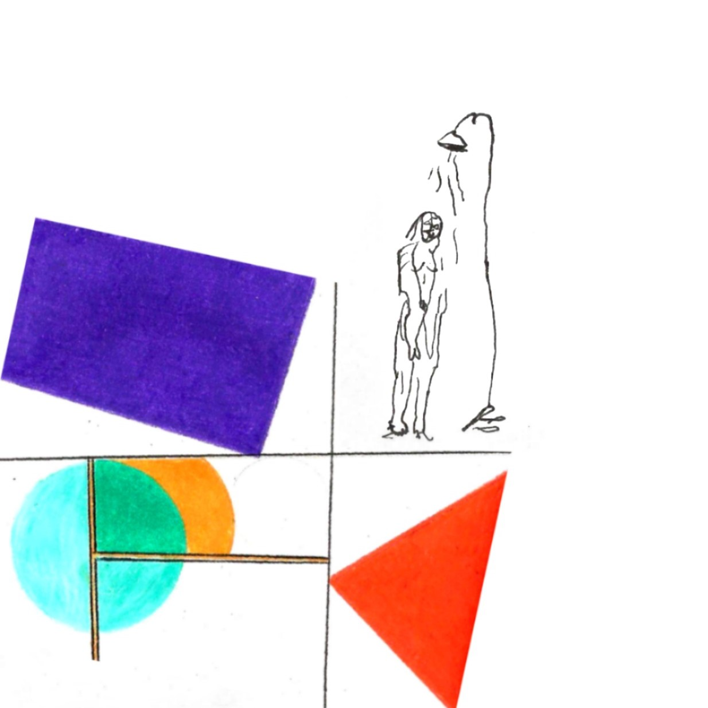
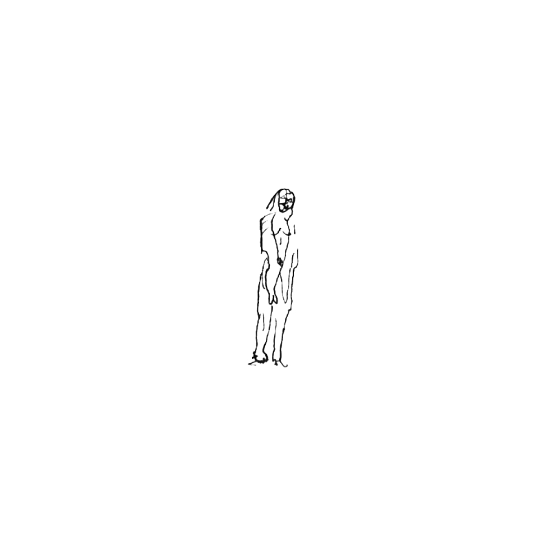
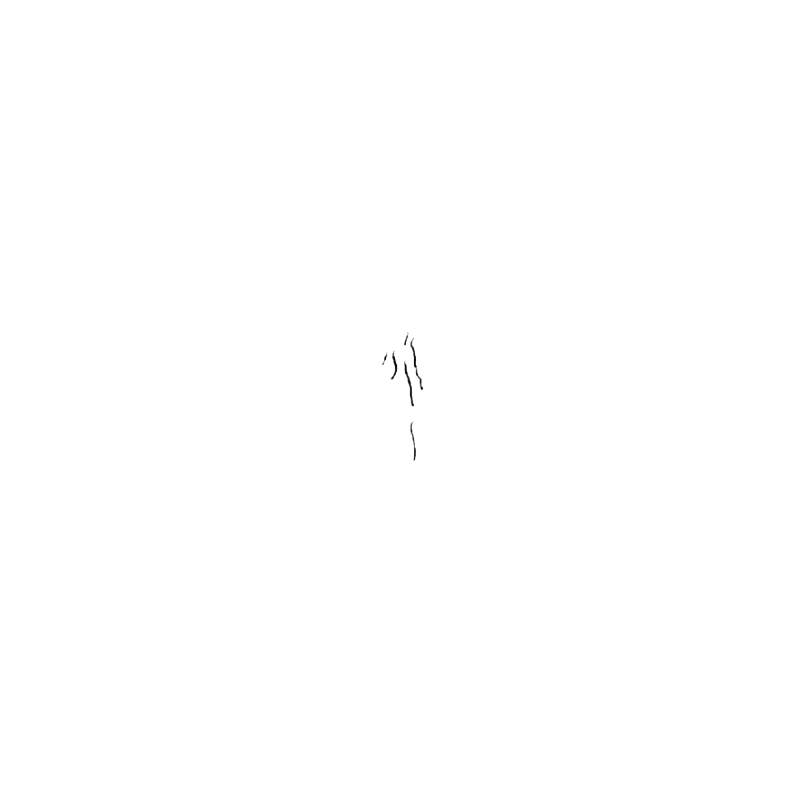
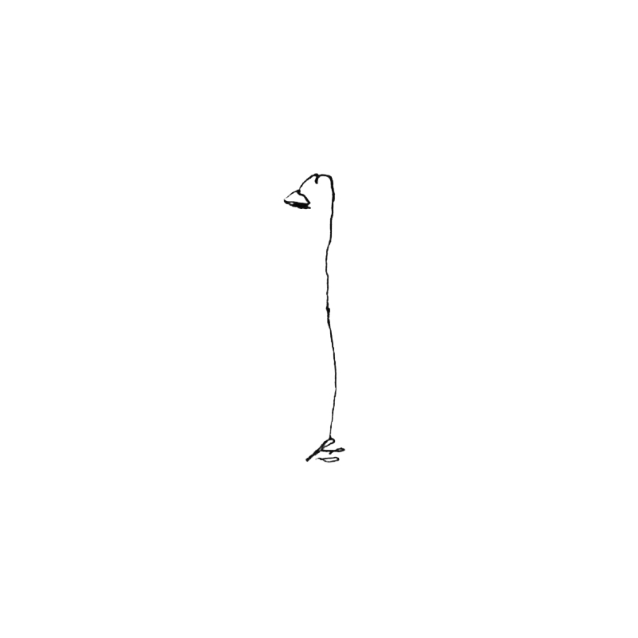
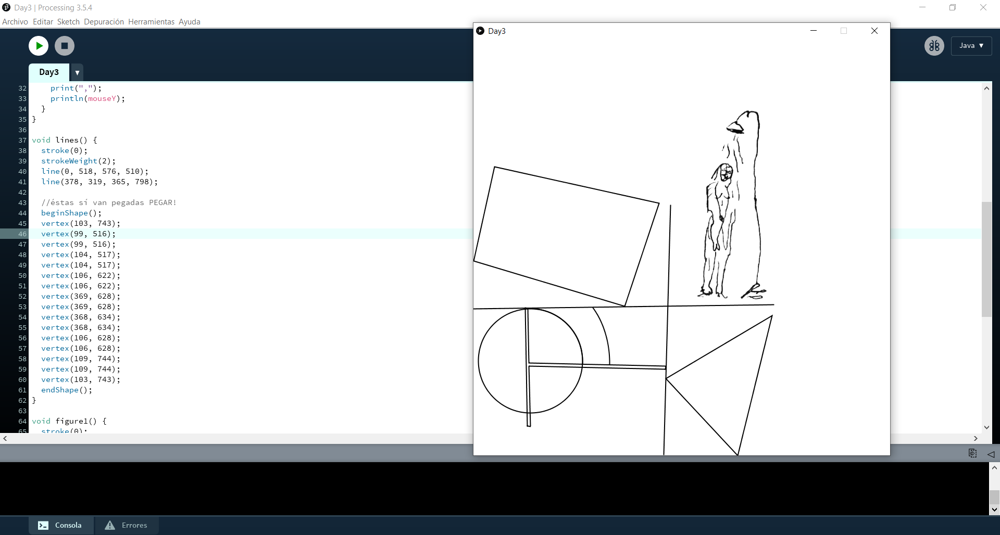

## Day 3 | Tuesday 07/06/2021 : final Project
  
[← return](https://github.com/andresugartechea/introToIM/blob/main/finalProject/day2/day2.md)  
[MAIN PAGE](https://github.com/andresugartechea/introToIM/blob/main/finalProject/journal.md)  
[next →](https://github.com/andresugartechea/introToIM/blob/main/finalProject/day4/day4.md)  

## Tasks:

·Work on the new concept.

## Progress:

I decided that I wanted to recreate one of my artworks on Processing and control the shapes, hues, colors and more on Arduino. I chose this one because it has simple figures and shape that I can easily reproduce on Processing.



I knew the painting of the woman showering would be difficult to draw on Processing, so I used this scanned version of the painting to edit it on Photoshop and to erase the background.

   

## Code commented: 

For this part of my project, I asked Processing to print the coordinates of the mouse when is clicked. Then, I put the original image on the background with the same size as the canvas, so I could click on it and know the coordinates of each vertex of the figures.

````
PImage sad;
PImage woman;
PImage water;
PImage shower;

void setup() {
  size (800, 800);

  //load image
  sad = loadImage ("sad.jpg");
  woman = loadImage("woman.png");
  water = loadImage("water.png");
  shower= loadImage("shower.png");
}

void draw() {
  background(255);
  //image (sad,0,0, 800, 800);     I put the image on the background so I could know the coordinates of each point when I click on it
  image(shower, 130, -80);
  image(water, 95, -150);
  image(woman, 70, -35);
  
  figure4();
  figure5();
  lines();
  figure1();
  figure2();
  figure3();

  //To check location of each point
  if (mousePressed) {
    print(mouseX);
    print(",");
    println(mouseY);
  }
}

void lines() {
  stroke(0);
  strokeWeight(2);
  line(0, 518, 576, 510);
  line(378, 319, 365, 798);

  beginShape();
  vertex(103, 743);
  vertex(99, 516);
  vertex(99, 516);
  vertex(104, 517);
  vertex(104, 517);
  vertex(106, 622);
  vertex(106, 622);
  vertex(369, 628);
  vertex(369, 628);
  vertex(368, 634);
  vertex(368, 634);
  vertex(106, 628);
  vertex(106, 628);
  vertex(109, 744);
  vertex(109, 744);
  vertex(103, 743);
  endShape();
}

void figure1() {  
  stroke(0);
  noFill();
  quad(40, 245, 356, 315, 290, 513, 0, 426);
  
}

void figure2(){ 
  stroke(0);
  triangle(573,531, 369, 652, 507, 800);
}

void figure3(){
  stroke(0);
  circle(109, 618,200);
}

void figure4(){
  stroke(0);
  arc(106, 621, 208, 208, radians(269), radians(362));

}

void figure5(){
  stroke(0);
  arc(152, 623,220,302,radians(315), radians(361));
  
  noStroke();
  quad(228, 515, 104, 517, 106, 622, 228, 624);
````
This is what Processing draws when the program is running:

 

## Modifications:

I changed my concept and now I'll try to make something interesting with the sensors.

## Problems to solve:

I need to figure out what I want to do with each sensor.

[← return](https://github.com/andresugartechea/introToIM/blob/main/finalProject/day2/day2.md)  
[MAIN PAGE](https://github.com/andresugartechea/introToIM/blob/main/finalProject/journal.md)  
[next →](https://github.com/andresugartechea/introToIM/blob/main/finalProject/day4/day4.md)  
