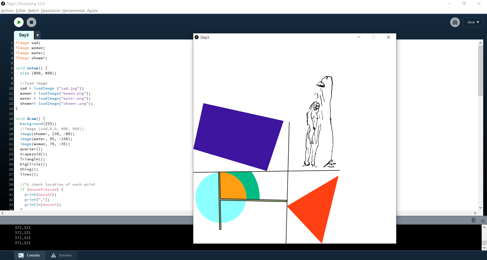

## Day 4 | Wednesday 07/07/2021 : final Project
  
[← return](https://github.com/andresugartechea/introToIM/blob/main/finalProject/day3/day3.md)  
[MAIN PAGE](https://github.com/andresugartechea/introToIM/blob/main/finalProject/journal.md)  
[next →](https://github.com/andresugartechea/introToIM/blob/main/finalProject/day5/day5.md)  

## Tasks:

· To implement the sensors to modify the painting.

## Progress:

Today, I finished drawing and coloring the painting on Processing.



I started giving functionalities to each one of the sensors. So far:  
    - the potentiometer makes rotate the figures and changes the their color from black and white to their original hue.  
    - the SPDT displays the image of the woman on screen.  

_(I forgot to record this part of the project, but these fonctionalities are kept in the final product)_

## Code commented: 

The code on Arduino is still the same one. This is an example of how the potentiometer affects one of the figures on Processing:

First, we declare the variables controlled by the sensor:
````
int potTransparency = 0;        //(pot) potentiometer: changes de transparency of "water.png"
int potColor = 0;               //changes de color of each figure
int potAngle = 0;               //rotation angle of each figure
````

We assign the values detected by the sensor to the variables:

````
void serialEvent (Serial myPort) {

  // get the ASCII string:
  String s = myPort.readStringUntil('\n');
  // trim off any whitespace:
  s = trim(s);

  // Always check to make sure the string isn't empty
  if (s != null) {
    println(s);
    int values[]= int(split(s, ','));

    if (values.length==4) {
      potTransparency = (int)map(values[1], 0, 1023, 0, 255); 
      potColor = (int)map(values[1], 0, 1023, 100, 255);
      potAngle = (int)map(values[1], 0, 1023, 0, 360);  
      potSound = map(values[1], 0, 1023, 0, 1); 
    }
  }

  //println(LDRtext);

  // Tell Arduino we're ready for another
  myPort.write(1 + "\n"); // could be any value
}

````
We use the variables to control the figure:

````
void Triangle() {
  push();
  translate(507, 800);
  rotate(radians(potAngle-360));
  fill (potColor, potColor-191, potColor-236, potColor);
  noStroke();
  triangle(66, -269, -138, -148, 0, 0);
  pop();
}
````

## Modifications:

This day gave me so many ideas of how I can use the other sensors for my project. I also want to incorporate sounds and text to respect the assignment instructions.

## Problems to solve:

To find more creative ways to use the other three sensors.

[← return](https://github.com/andresugartechea/introToIM/blob/main/finalProject/day3/day3.md)  
[MAIN PAGE](https://github.com/andresugartechea/introToIM/blob/main/finalProject/journal.md)  
[next →](https://github.com/andresugartechea/introToIM/blob/main/finalProject/day5/day5.md)  
