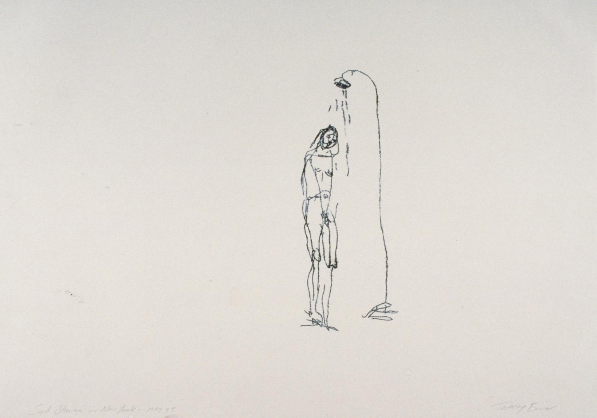
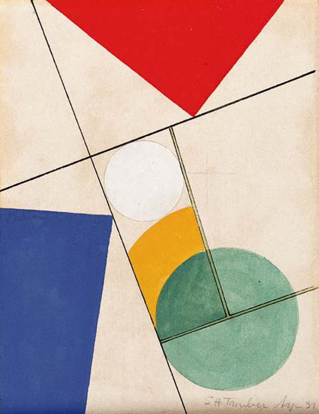

# Intro to IM | 07/04/2021 - 07/08/2021  : final Project
 
← [Go back](README.md)  
·Shortcut to [_"Sad Shower in New York"_, JOURNAL](#Journal)
 

## Intructions: project using serial communication between Arduino and Processing

Your final project must incorporate at least 4 of the following items from Arduino and at least 4 of the following items from Processing, and some form of communication between the two. 

·In Arduino, we learned about:
   - Analog Input  
   - Analog Output  
   - Digital Input  
   - Digital Output  
   - Servo motor  
   - Tone  
   - DC motor  
   - LCD  
   - Ultrasonic distance measuring sensor  
·In Processing:
   - Drawing with primitives  
   - Transformations  
   - Images  
   - Animation  
   - Sprites  
   - Sound  
   - Text  
   - Files  

## Project description:  

_"Sad shower in New York"_ is an artwork from my portfolio recreated on raster graphic editors and Processing to add interaction with Arduino using sensors. 

The concept is inspired by the juxtaposition of two paintings that I like: _"Sad shower in New York"_ by Tracey Emin (left), and _"Composition"_ by Sophie Taeuber-Arp (right).

 

The purpose of this project is to reinforce the melancholic tone of the original painting through the interactivity provided by the sensors, adding primarily sound, movement, animation and playing with the color palettes.

## Journal:

Day [1](day1/day1.md),  [2](day2/day2.md),  [3](day3/day3.md),  [4](day4/day4.md),  [5](day5/day5.md)

