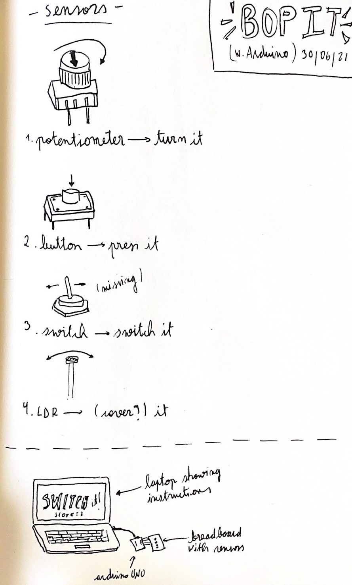

# Intro to IM |  -   : final Project
 

## Intructions: Your final project must incorporate at least 4 of the following items from Arduino and at least 4 of the following items from Processing, and some form of communication between the two. 

·In Arduino, we learned about:
    Analog Input
    Analog Output
    Digital Input
    Digital Output
    Servo motor
    Tone
    DC motor
    LCD
    Ultrasonic distance measuring sensor
·In Processing:
    Drawing with primitives
    Transformations
    Images
    Animation
    Sprites
    Sound
    Text
    Files

## Project description: Arduino sensor "Bob It"

For my final project I want to recreate the game _"Bob It"_ using sensors. I'll be using [Intructable Circuits' Simon says game tutorial](https://www.instructables.com/Arduino-Simple-Simon-Says-Game/) as reference, which has a similar playability.

I'm not sure if this idea is feasible, but for making the task easy I want to use these four sensors which I already know how to incorporate in circuits and coding. I plan on using Processing for the game instructions. The screen will indicate the user what to do and how to use the sensors.

