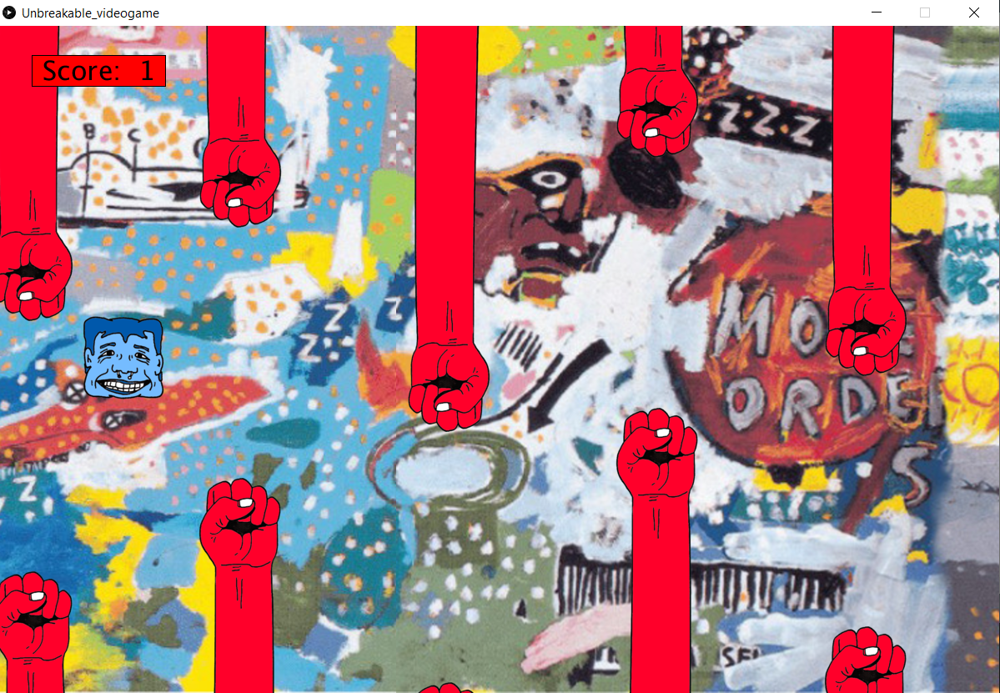

Clear instructions for playing the game
Screen shots of different game stages
Description of major problems and modifications you made to overcome them


# Intro to IM | 06/07/2021 - 06/14/2021  : midterm Project
 

## Intructions: 


## Project description:

_"Jump Rope"_ is a game where the player needs to click the mouse every time the rope approaches to avoid touching it. The player scores a point when they perform the task successfully, but the speed increases with every click. The game ends when the ball touches the rope. The scoreboard starts again from 0 so the user can play again and beat their record.

## Code commented:

This code can also be found in the repository. Click [here](#Gameplay) to skip this section.

````
/* 
 name: Andres Ugartechea
 assignment: midterm project
 date: 06/14/2021
 
 For this code, I used as reference the tutorial made by professor Allen Toe on his youtube channel (https://www.youtube.com/watch?v=IIrGAvlNckw&list=PLAE4MzuQm3Gwj2QLcqpepbTuIuzi_18mS).
 To create my game state system, John McCaffrey's tutorials were really helpful (https://www.youtube.com/watch?v=JwQ43aBGz0E&ab_channel=JohnMcCaffreyJohnMcCaffrey).
 He also has a tutorial on how to work with sound on Processing that I used for this project (https://www.youtube.com/watch?v=I6fG1wneXWo&t=63s&ab_channel=JohnMcCaffreyJohnMcCaffrey).
 
 
 */

//Sound
import processing.sound.*;          //library
SoundFile jumpSound;
SoundFile winning;
SoundFile losing;

//Images
PImage background; 
PImage player; 
PImage topPipe; 
PImage bottomPipe;
PImage startMenu;
PImage loseGame;

//Variables background
int bX;
int bY;

//Variables player
int plX;                            //pl: "player"
int plY;
int g;                              //"gravity"
int jump;

//Variables pipes
int spacePipes;
int safeZoneX;
int safeZoneY;
int [] pipeX;
int [] pipeY;
int gameSpeed;

//Score 
int score;

//Game states: 'string' instead of 'boolean' because there's more than one state. Sting allows us to use a name instead of a number.
String gameState;


void setup() {
  size(1200, 800);
  background(0);

  //to load music: the files were downloaded from freesound.org and they're released under Creative Commons licenses that allow their reuse
  jumpSound = new SoundFile(this, "jumpSound.mp3");          //https://freesound.org/people/cabled_mess/sounds/350903/
  winning = new SoundFile(this, "winning.mp3");              //https://freesound.org/people/Scrampunk/sounds/345297/
  losing = new SoundFile(this, "losing.mp3");                //https://freesound.org/people/Fupicat/sounds/538151/

  //to load images
  background = loadImage("background.png");                  //the background image is an edit of the painting "UNBREAKABLE" by Jean-Michel Basquiat
  player = loadImage("player.png");
  bottomPipe = loadImage("bottomPipe.png");
  topPipe = loadImage("topPipe.png");
  startMenu = loadImage ("startMenu.png");
  loseGame = loadImage ("loseGame.png");

  //to define variables
  plX = 100;
  plY = 50;
  g = 1;
  gameSpeed = 2;                          //this changes the game difficulty. The bigger, the faster the game goes
  spacePipes = 250;                       //separation between each pair of pipes. This can be changed to modify the difficulty
  safeZoneX = 75;                         //value set after various tests
  safeZoneY = 300;                        //gap between top and bottom pipes
  pipeX = new int[5];                     //5 pipes created every time
  pipeY = new int[pipeX.length];

  //to define the array
  for (int i = 0; i< pipeX.length; i++) {
    pipeX[i] = width + spacePipes*i;             //"300" gives the space between each pair of pipes
    pipeY[i]= int(random(-350, 0));              //"random (-350, 0)" gives the starting position of each pair of pipes in the Y-axis. The larger this number, the higher they are located
  }

  //The program starts with the Menu page. That's why we put it in 'setup()'
  gameState = "START";
}


//We define each state in 'draw()'
void draw() {

  if (gameState == "START") {                //"START" is the Menu page
    startGame();
  } else if (gameState == "PLAY") {         //"PLAY" is the game
    playGame();
  } else {                                 //the rest is the end screen with the score and the re-start button
    loseGame();
    restartGame();
  }
}


//gameState == START
void startGame() {

  //the player is placed in the middle of the screen
  plY = height/2;
  image(startMenu, 0, 0);

  //the game starts when the user click any part of the screen
  if (mousePressed) {
    gameState = "PLAY";
  }
}


//gameState == "PLAY"
void playGame() {
  wallpaper();
  pipes();
  player();
  score();
}


//gameState == "LOSE"
void loseGame() {
  image (loseGame, 0, 0);
  finalScore();
}


//gameState == "RESTART"
void restartGame() {

  /* 
   I used this part to check the area that the user needs to click to restart the game, but it's not necessary to draw it because there's already an image.
   
   int buttonX = 340;
   int buttonY = 285;
   
   //restart area
   fill(0, 255, 0,80);
   rect(width-buttonX,height-buttonY, buttonX,buttonY);*/

  if (mousePressed && mouseX < width && mouseX >(width-340) && mouseY < height && mouseY > (height-285)) {
    plY = height/2;                          //the player is located again in the middle of the screen
    for (int i=0; i<pipeX.length; i++)        //the pipes are relocated out of the screen to start playing
    {
      pipeX[i] = width + spacePipes*i;
      pipeY[i] = int(random(-350, 0));
    }
    score = 0;                               //the score resets
    gameState = "PLAY";
  }
}


//to control character
void mousePressed() {
  jump = -15;                                //the smaller the value, the higher the jump
  jumpSound.play();                          //a sound is played when the character jumps
}


//to give mobility to the character
void player () {
  image(player, plX, plY);
  plY = plY+jump;
  jump = jump+g;                              //this makes the character fall after jumping

  //the player loses if they go out of the screen
  if (plY > height+100 || plY<-100) {
    losing.play();                            //a sound is played when the player loses
    gameState = "LOSE";
  }
}


//to draw and animaate the pipes
void pipes() {
  for (int i = 0; i <pipeX.length; i++) {                                        //i: index
    image(topPipe, pipeX[i], pipeY[i]);
    image(bottomPipe, pipeX[i], pipeY[i]+500+safeZoneY);
    pipeX[i] -= gameSpeed;                                                       //this moves the pipes to the right
    if (pipeX[i] < -200) {
      pipeX[i] = width;                                                          //this places the pipes out of the screen when the game starts
    }
    if (plX >(pipeX[i]-safeZoneX) && plX < pipeX[i]+100) {                       //safe zone in the x-axis
      if (!(plY > pipeY[i]+500 && plY < pipeY[i] + 500 + (safeZoneY-60))) {      //safe zone in the y-axis
        losing.play();                                                           //sound plays when the uses loses
        gameState = "LOSE";
      } else if (plX == pipeX[i]) {
        score++;
        winning.play();                                                          //sound plays when a pipe is crossed
      }
    }
  }
}


//for the background
void wallpaper() {
  image (background, bX, bY);
  image (background, bX + background.width, bY);
  bX = bX - (gameSpeed-1);               //This scrolls the image. '(gameSpeed-1)' gives the illusion of depth
  if (bX < -background.width) {          //the image is reset when the screen scrolls the entire image
    bX = 0;
  }
}


void score() {
  fill(255, 0, 0);
  rect(40, 35, 160, 37);
  fill(0);
  textSize(32);
  text (" Score:  " + score, 43, 65);
}


void finalScore() {
  fill(0, 255, 255);
  rect(width/2-130, 155, 244, 37);
  fill(0);
  textSize(32);
  text (" Final Score:  " + score, width/2-125, 185);
}
````

## Gameplay:




[Here](https://youtu.be/yphFfRWPMsw), you can find a gameplay.

## Journal:

·[JOURNAL](journal.md)
