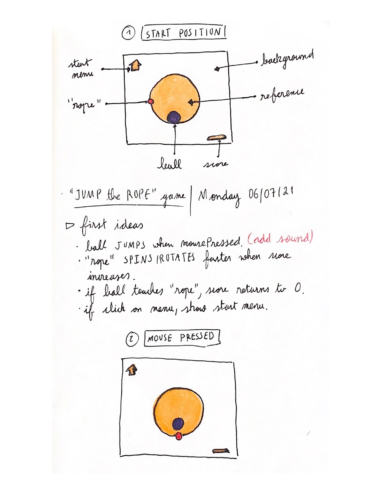

At least everything we have included up to now
Clear instructions for playing the game
Screen shots of different game stages
Description of major problems and modifications you made to overcome them
Program to include
At least everything we have included up to now
Very commented code, especially for any confusing or tricky parts

# Intro to IM | 06/07/2021 - 06/14/2021  : midterm Project
 

·[JOURNAL](journal.md)

## Intructions: 

## Project description:

_"Jump Rope"_ is a game where the player needs to click the mouse every time the rope approaches to avoid touching it. The player scores a point when they perform the task successfully, but the speed increases with every click. The game ends when the ball touches the rope. The scoreboard starts again from 0 so the user can play again and beat their record.

_(Last modified: 06/06/2021)_

## Gameplay:

[video](https://youtu.be/yphFfRWPMsw)

## Journal:

[Day 1 - Monday](day1/Monday07.md)  
[Day 2 - Tuesday](day2/Tuesday08.md)  
[Day 3 - Wednesday](day3/Wednesday09.md)  
[Day 4 - Thursday](day4/Thursday10.md)   
[Day 5 - Friday](day5/Friday11.md)  
[Day 6 - Saturday](day6/Saturday12.md)  
[Day 7 - Sunday](day7/Sunday13.md)  
