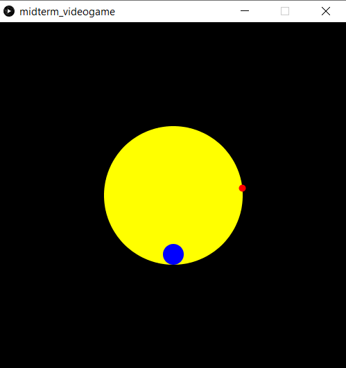
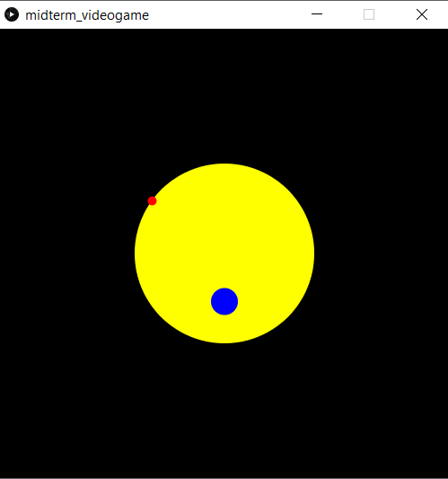

## Day 1 | Monday 06/07/2021 : midterm Project

## Tasks:

·Work on the concept of the videogame.  
·Watch videos with similar playability.  
·Start working on the code to have an idea of what the videogame is going to look like.

## Progress:

Today, I started developping the concept of my videogame. I wanted to create something simple to be able to finish the project in time, so I watched tutorials on how to code videogames on Processing. The one that attracted my attention the most was [_"Flappy Bird"_](https://thecodingtrain.com/CodingChallenges/031-flappybird.html), because it used to be one of my favorite mobile videogames.

I want this project to be a challenge for me but at the same time I'm new at coding so I don't want to get lost easily. That's why I decided to use this _"Flappy Bird"_ tutorial as reference to code my own game. Also, I was thinking about recreating a traditional game from the real world that has to do with jump and avoiding touching things as _"Flappy Bird"_ and the jump rope game was my initial thought.

Before coding, I made some drawings to have a better idea of how I needed to start with this project:


## Code commented:

````
/*
Measures:
  start distance: start = width/2+85
  jump (20 pixels): jump = width/2+65

*/
                    
float start = width/2+285;                //for some reason, the 'start' measure shifts 200 units in the y-axis when is used in 'void draw()'
float angle = 90;                         //with this angle the rope appears on the left and gives enough time to the user to prepare to play
float speed = 0.02;                       //this is the initial speed
//float speedAugmentation = ?             I'll have to define this value later


void setup() {
  
  size(500, 500);
  background(0);                          //CHANGE BACKGROUND FOR IMAGE
  
}


void draw() {
  
  //'void rope()' contains a background and the rope spinning. That's why it's drawn first
  rope();
  //'void ball()' contains the ball that is controlled with the mouse
  ball();
  
}


void rope(){
  
  //black background
  background(0);
  
  //yellow ellipse used as reference for the movement of the rope
  fill(255, 255, 0);
  ellipse(width/2, height/2, 200, 200);
  
  //rope
  push();
  translate(width/2, height/2);           //the center of the canvas is the point of rotation
  rotate(angle);
  angle = angle + speed ;
  stroke(255,0,0);
  strokeWeight(10);                  
  point(0, 100);                          //perhaps I'll have to draw an ellipse instead of a point to work with distances.
  pop();
  
}


void ball(){
  
  //I'll use this part to make the ball jump.
  if(mousePressed){
    start-=0.5;
  }
  //this draws a blue ball
  noStroke();
  fill(0, 0, 255);
  ellipse (width/2, start, 30, 30);
  
}
````

## Results:

This is what we obtain when we run the program: https://youtu.be/V2Lvg1DU9OE

·Start position:


·After mouse is clicked:



## Modifications:

I discarded previous concepts for this assignment. I originally was planning to develop a game similar to _Minesweeper_, with a playability identical to _Bomberman_. I might be using this concept for a future project.

## Problems to solve:

·Look for functions to make the ball jump every time the mouse is clicked.
