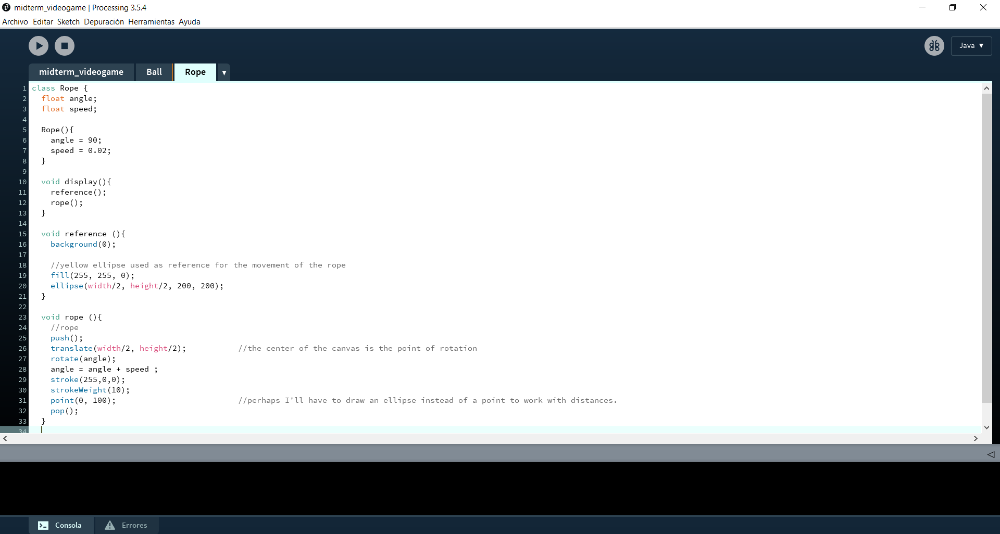

## Day 2 | Tuesday 06/08/2021 : midterm Project
  
[← return](https://github.com/andresugartechea/introToIM/blob/main/midtermProject/day1/Monday07.md)  
[MAIN PAGE](https://github.com/andresugartechea/introToIM/blob/main/midtermProject/journal.md)  
[next →](https://github.com/andresugartechea/introToIM/blob/main/midtermProject/day3/Wednesday09.md)  

## Tasks:

·Give a format to my journal.  
·Continue working on the code.  
·Plan the tasks for the next days.  

## Progress:

## Code commented: 

https://youtu.be/tTa7B9S-_hw

## Modifications:

## Problems to solve:

[← return](https://github.com/andresugartechea/introToIM/blob/main/midtermProject/day1/Monday07.md)  
[MAIN PAGE](https://github.com/andresugartechea/introToIM/blob/main/midtermProject/journal.md)  
[next →](https://github.com/andresugartechea/introToIM/blob/main/midtermProject/day3/Wednesday09.md) 
