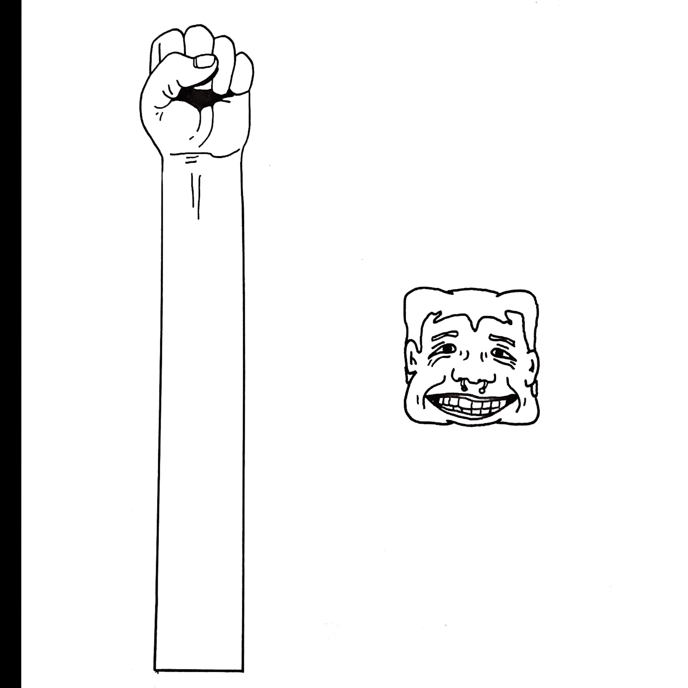
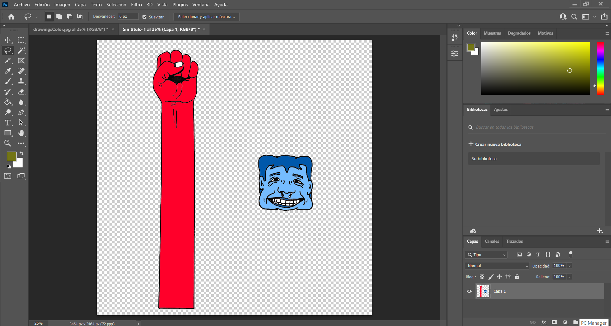
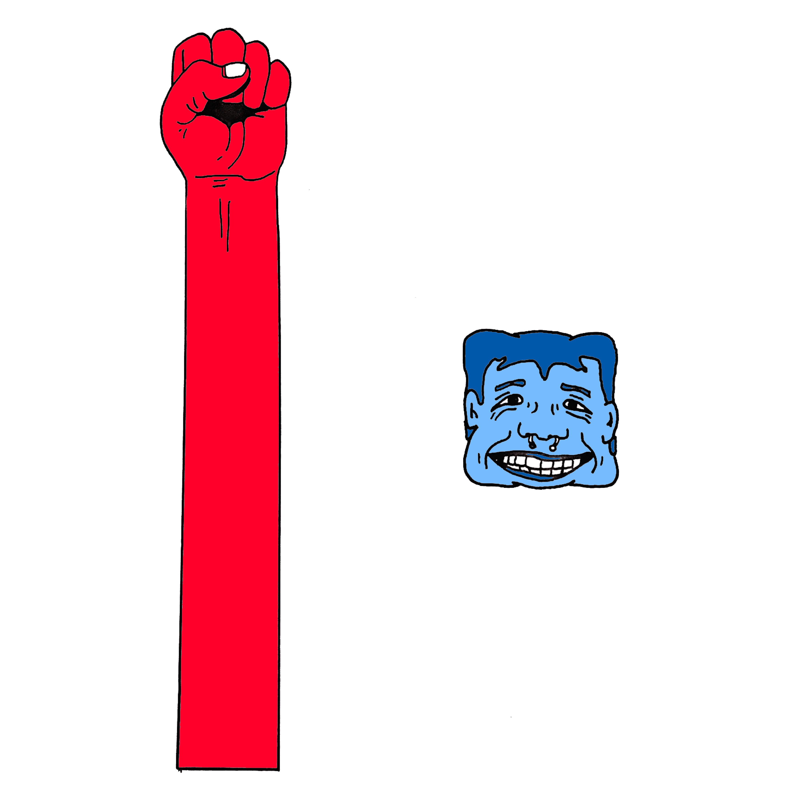
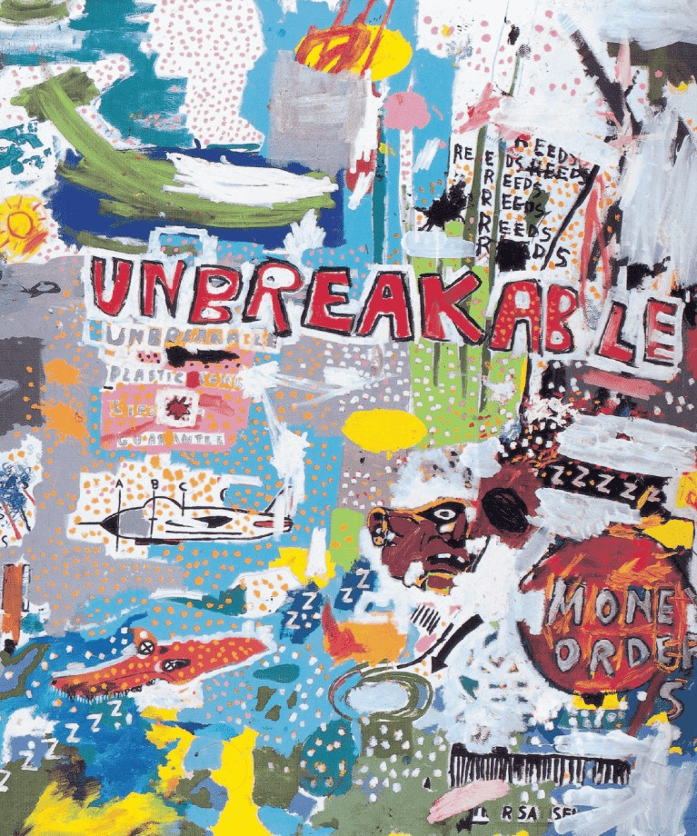
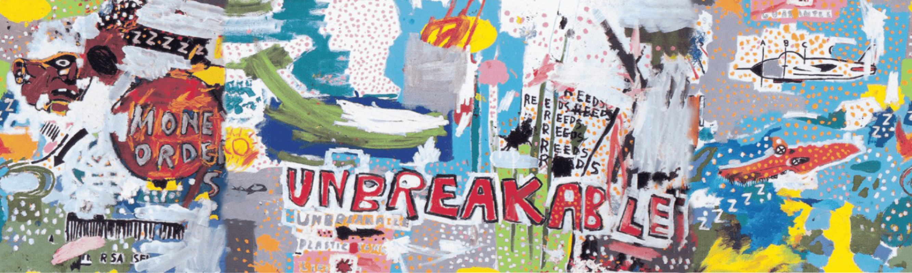

## Day 4 | Thursday 06/10/2021 : midterm Project

[← return](https://github.com/andresugartechea/introToIM/blob/main/midtermProject/day3/Wednesday09.md)  
[MAIN PAGE](https://github.com/andresugartechea/introToIM/blob/main/midtermProject/journal.md)  
[next →](https://github.com/andresugartechea/introToIM/blob/main/midtermProject/day6/Saturday12.md)  

## Tasks:

·To start working on a different concept.  
·To give a desing to the videogame.   
·To scan and edit drawings.  
·To study _Flappy Bird_'s code.

## Progress:

I couldn't figure out how to add the collision detection to my previous concept, so I decided to change of idea. I was already using [_Flappy Bird_'s tutorial](https://www.youtube.com/watch?v=cXgA1d_E-jY&ab_channel=TheCodingTrain) as reference for my code, thus I chose to study it in detail so I could make my own version of the videogame.

I started writing the code that is in [the next section](#Code-commented). After that, I had to draw the obstacles and the playable character so I can use them later for the collision detection part. I came up with a random desing that I had in mind and I think it worked pretty well. Then, I scanned the drawings and edited them on Photoshop, deleting the background and adding colour.

  
  
  


For the background I wanted to use a painting of one of my favorite artists, Jean-Michel Basquiat. I chose one called _UNBREAKABLE_, which gave the name to this game. I also edited this painting on Photoshop so it could be scrolled on screen.

  
 

Finally, I uploaded the images to my program to see the result.

## Code commented:

I had to use another code as reference, written by [professor Allen Thoe](https://www.youtube.com/watch?v=IIrGAvlNckw&list=PLAE4MzuQm3Gwj2QLcqpepbTuIuzi_18mS&ab_channel=AllenThoeAllenThoe).

````
//Images
  PImage background; 
  PImage player; 
  PImage topPipe; 
  PImage bottomPipe;

//Variables background
  int bX;             //x coordinate
  int bY;             //y coordinate
  
//Variables player
  int plX;            //x coordinate
  int plY;            //y coordinate
  int g;              //"gravity"
  int jump;
  
//Variables pipes
  int [] pipeX;
  int [] pipeY;


void setup() {
  size(1200, 800);
  background(0);
  
  //to load images
  background = loadImage("background.png");
  player = loadImage("player.png");
  bottomPipe = loadImage("bottomPipe.png");
  topPipe = loadImage("topPipe.png");
  
  //Defining variables
  plX = 100;
  plY = 50;
  g = 1;
  pipeX = new int[5]; 
  pipeY = new int[pipeX.length];
  
  //Defining array
  for(int i = 0; i< pipeX.length; i++){
    pipeX[i] = width + 200*i;
    pipeY [i]= (int)random(-350, 0);
  }
}


void draw() {
  setBackground();
  player();
  
    for(int i = 0;i<pipeX.length; i++){
      image(topPipe, pipeX[i], pipeY[i]);
      image(bottomPipe, pipeX[i], pipeY[i]+800);
      pipeX[i]-=2;                                 //game speed
      if(pipeX[i] < -200){
        pipeX[i] = width;
      }
    }
}


//to control character
void mousePressed() {
  jump = -15;
}


//to give mobility to the character
void player (){
  image(player , plX, plY);
  plY = plY+jump;
  jump = jump +g;
}


//for the background
void setBackground() {
  image (background, bX, bY);
  image (background, bX + background.width, bY);
  bX = bX -1;
  if(bX < -background.width) {
    bX = 0;
  }
}
````

## Results:

[Here](https://youtu.be/HzrptKuqBsU) you can see how my project looks like so far.

## Modifications:

I practically had to change everything except for the playability of the game, which is almost the same one as the previous concept.

## Problems to solve:

·Collision detection.
·Add sound.
·Create start and end pages.

[← return](https://github.com/andresugartechea/introToIM/blob/main/midtermProject/day3/Wednesday09.md)  
[MAIN PAGE](https://github.com/andresugartechea/introToIM/blob/main/midtermProject/journal.md)  
[next →](https://github.com/andresugartechea/introToIM/blob/main/midtermProject/day6/Saturday12.md)  
