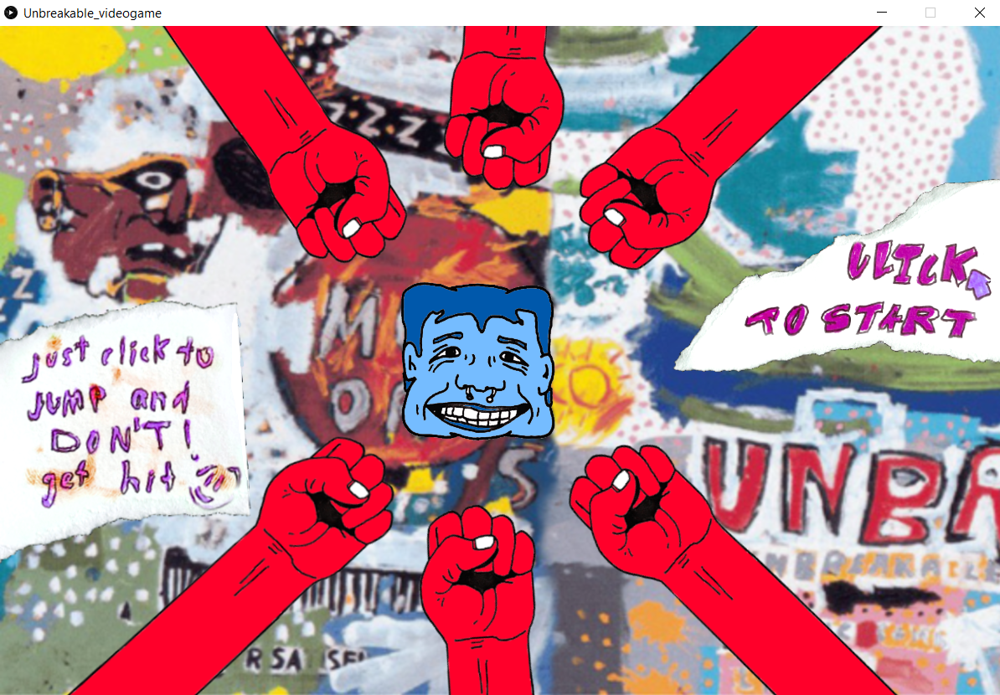

# Intro to IM | 06/07/2021 - 06/14/2021  : midterm Project
 
·Shortcut to [_"UNBREAKABLE"_, JOURNAL](#Journal)

## Intructions: Make a game using everything you have learned so far

  ·The game can be for one or more players.  
  ·The game must not be a shooting game (down with violence!).  
  ·The game must include:  
     - at least one shape.  
     - at least one image.  
     - at least one sound.  
     - at least one on-screen text.  
  ·The game must start with a screen giving instructions, and must wait there until a button or key (your choice) is pressed.  
  ·After the game is won or lost, there must be a way to restart the game without closing and restarting the program.  

## Project description:

_"UNBREAKABLE"_ is a videogame inspired by [_"Flappy Bird"_](https://www.youtube.com/watch?v=fQoJZuBwrkU) that started as a jump rope game. It doesn't have a storyline, but its concept is based on Jean Michel Basquiat's artworks. The background of this project is a clear reference of this artist.

The playability is simple, but the game is not that easy. The purpose of this game is to entertain the users by making them want to score higher and higher. This playability proved to be attractive with the huge success of _"Flappy Bird"_ before being removed from the app store. Personally, it was one of my favorite games and that's why I decided to recreate it with my own style. 

_(Last modified: 06/14/2021)_

## Journal:

[Day 1](day1/Monday07.md)  
[Day 2](day2/Tuesday08.md)  
[Day 3](day3/Wednesday09.md)  
[Day 4](day5/Friday11.md)  
[Day 5](day6/Saturday12.md)  
[Day 6](day7/Sunday13.md)  

