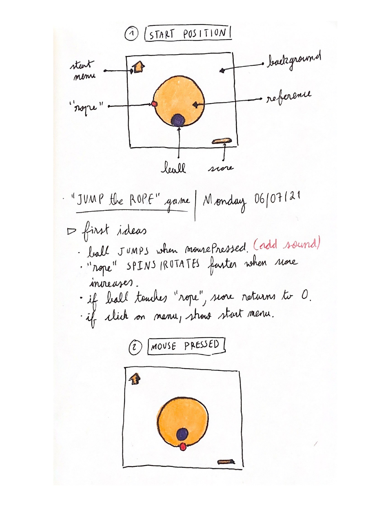

# Intro to IM | 06/07/2021 - 06/14/2021  : midterm Project
 
·Shortcut to [_"Jump rope"_, JOURNAL](#Journal)

## Intructions: Make a game using everything you have learned so far

  ·The game can be for one or more players.  
  ·The game must not be a shooting game (down with violence!).  
  ·The game must include:  
     - at least one shape.  
     - at least one image.  
     - at least one sound.  
     - at least one on-screen text.  
  ·The game must start with a screen giving instructions, and must wait there until a button or key (your choice) is pressed.  
  ·After the game is won or lost, there must be a way to restart the game without closing and restarting the program.  

## Project description:

_"Jump Rope"_ is a game where the player needs to click the mouse every time the rope approaches to avoid touching it. The player scores a point when they perform the task successfully, but the speed increases with every click. The game ends when the ball touches the rope. The scoreboard starts again from 0 so the user can play again and beat their record.

_(Last modified: 06/06/2021)_

## Journal:

[Day 1 - Monday](day1/Monday07.md)  
[Day 2 - Tuesday](day2/Tuesday08.md)  
[Day 3 - Wednesday](day3/Wednesday09.md)  
[Day 4 - Thursday](day4/Thursday10.md) 
[Day 5 - Friday](day5/Friday11.md)  
[Day 6 - Saturday](day6/Saturday12.md)  
[Day 7 - Sunday](day7/Sunday13.md)  

